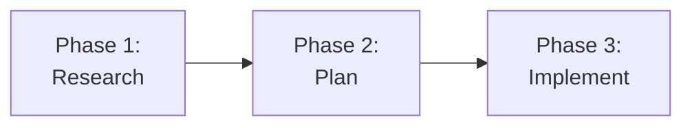

# Docusaurus Content Instructions

These instructions apply automatically when editing any file under `docs/`. Follow them to maintain consistency across the documentation site.

## Frontmatter

Every documentation page requires these frontmatter fields:

* `title`: Page title displayed in the browser tab and sidebar
* `description`: One-sentence summary for SEO and social sharing
* `sidebar_position`: Integer controlling page order within its category (1, 2, 3...)

Optional fields:

* `sidebar_label`: Override the sidebar display text when it should differ from `title`
* `keywords`: Array of terms for search indexing
* `tags`: Array of tags for content categorization

```yaml
---
title: The RPI Workflow
description: How the Research-Plan-Implement-Review loop structures AI-assisted development
sidebar_position: 2
sidebar_label: RPI Workflow
keywords: [rpi, research, plan, implement, review]
tags: [build-the-work, rpi, workflow]
---
```

## Admonitions

Both Docusaurus admonitions (`:::note`, `:::tip`, `:::warning`) and GitHub-style alerts (`> [!NOTE]`, `> [!TIP]`, `> [!WARNING]`) are supported. GitHub-style alerts render correctly in Docusaurus via `remark-github-blockquote-alert` and on GitHub natively. Prefer GitHub-style alerts for content that must render on both platforms.

```markdown
:::note
Useful information that users should know, even when skimming.
:::

:::tip
Helpful advice for doing things better or more easily.
:::

:::info
Additional context that clarifies a concept.
:::

:::warning
Important information that could prevent problems.
:::

:::danger
Critical information about potential data loss or security issues.
:::
```

## Internal Links

Link between documentation pages using relative paths without the `.md` extension:

```markdown
<!-- Correct -->
See [How It Works](getting-started/how-it-works) for architecture details.

<!-- Incorrect — .md extension causes build warnings -->
See [How It Works](getting-started/how-it-works.md) for architecture details.
```

Cross-category links use relative paths from the current file location:

```markdown
<!-- From ship-it/overview.md to getting-started/how-it-works.md -->
[How It Works](../getting-started/how-it-works)
```

## Mermaid Diagrams

Use fenced code blocks with the `mermaid` language identifier. Line breaks within nodes use `<br/>` (not `\n`).

````markdown

````

Verify diagrams render in both light and dark themes. Use minimal inline styling; avoid hardcoded colors that break in dark mode unless both themes are tested.

## Category Structure

Each sidebar category is a directory containing a `_category_.json` file:

```json
{
  "label": "Getting Started",
  "position": 1,
  "collapsible": true,
  "collapsed": false
}
```

Adding a new top-level category changes the site information architecture. Discuss with maintainers before creating one. The current category hierarchy is:

1. Getting Started
2. HVE Guide
3. RPI
4. Agents
5. Architecture
6. Contributing
7. Security
8. Templates

## Images

Place images in `docs/docusaurus/static/img/` and reference them with absolute paths from the site root:

```markdown

```

## Code Blocks

Always specify a language identifier for syntax highlighting. Use `text` when no highlighting is needed:

````markdown
```yaml
title: Example Configuration
```

```text
Plain text output with no highlighting
```
````

## Page Ordering

Use sequential `sidebar_position` values (1, 2, 3...) within each category. Gaps in numbering are acceptable when anticipating future pages.

## Page Length and Structure

Aim for 5-10 minute read time per page (~100-200 lines of content excluding code blocks and diagrams). When a page exceeds this, split into multiple pages or use progressive disclosure.

Each paragraph communicates one core idea. If a paragraph requires re-reading, it is trying to do too much.

Every major concept (anything that gets its own H2 heading) should have either a diagram, a table, a code example, or a concrete real-world scenario alongside its prose explanation. Text-only sections lose readers who learn visually.

## Progressive Disclosure

For advanced or detailed content within a page, use Docusaurus `<details>` blocks or link to separate reference pages. Essential information stays in the main flow; advanced detail is discoverable but not mandatory.

```markdown
<details>
<summary>Advanced: Handoff file field reference</summary>

The handoff file supports the following fields...

</details>
```

Structure pages so a reader who stops after section 2 has gotten value. If they must read to the end for the page to make sense, restructure.

## Search Keywords

Include a `keywords` array in frontmatter for pages that serve as reference or entry points. Keywords should include terms users might search for, not just terms used on the page:

```yaml
keywords: [backlog, triage, sprint planning, github issues, prioritization]
```

## Educational Tone

Lead with "why this matters" before explaining "how to use the tool." Reference DORA, SPACE, and ESSP frameworks where relevant to connect tooling to measurable outcomes.

Address the reader as "you." Use "we" when speaking for the project. Avoid marketing language ("powerful," "seamless," "revolutionary") and unsupported productivity claims.

Ground abstract concepts in concrete examples. "Higher deployment frequency" is abstract; "a team deploying weekly has fundamentally different feedback loops than a team deploying hourly" is concrete.

## Cross-Linking

Link when the reader is likely unfamiliar with the referenced concept. Do not link every mention of a term. Over-linking forces readers to constantly decide whether to follow each link.

When referencing content in other segments, link only to pages that exist. For pages not yet created, use plain text with an HTML TODO comment marking the future link location.

## Value Tags

When mentioning HVE-Core artifacts in documentation, note their value assessment where it adds context:

* 🟢 Core: High value, directly supports a documented flow
* 🟡 Supporting: Useful but secondary
* ⚪ Meta: Internal tooling for HVE-Core authors, not end users

The full assessment is in the value delivery segments workshop document. Not every mention needs a tag; use them when distinguishing between core and supporting artifacts helps the reader prioritize.
