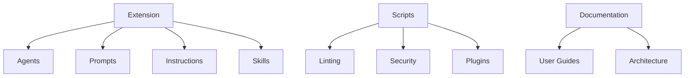

HVE Core provides a Copilot customization framework that enables teams to extend GitHub Copilot with project-specific context, workflows, and automation. The framework organizes reusable AI artifacts, development scripts, and documentation into a cohesive system that integrates with VS Code and GitHub workflows.

## System Architecture

The following diagram illustrates the primary components and their relationships:

## Component Summary

| Component           | Location                   | Purpose                                                                       |
|---------------------|----------------------------|-------------------------------------------------------------------------------|
| Extension           | `extension/`               | VS Code extension providing contribution points for AI artifacts              |
| Scripts             | `scripts/`                 | PowerShell automation for linting, security validation, and plugin generation |
| Documentation       | `docs/`                    | User guides, architecture docs, and contribution guidelines                   |
| GitHub Assets       | `.github/`                 | Workflows, instructions, prompts, agents, skills, and issue templates         |
| Dev Container       | `.devcontainer/`           | Codespaces and local container development environment                        |
| Frontmatter Schema  | `scripts/linting/schemas/` | JSON schemas for AI artifact validation                                       |
| GitHub Workflows    | `.github/workflows/`       | CI/CD pipelines for validation, security, and release automation              |
| Access Control      | `.github/CODEOWNERS`       | Path-based review requirements and ownership                                  |
| MCP Configuration   | `.vscode/mcp.json`         | Model Context Protocol server definitions                                     |
| Plugins             | `plugins/`                 | Generated Copilot CLI plugin output from collection manifests                 |
| Test Infrastructure | `scripts/tests/`           | Pester test suites with fixtures and mocks                                    |

## Core Subsystems

### Extension

The VS Code extension serves as the integration layer between HVE Core artifacts and the Copilot experience. It registers contribution points that allow Copilot to discover and use agents, prompts, instructions, and skills defined within the repository. The extension follows VS Code extension packaging conventions and includes its own README and license.

### Scripts

Automation scripts handle quality assurance and development workflows. The scripts directory organizes functionality into specialized subdirectories:

* Linting scripts validate markdown formatting, link integrity, YAML structure, and PowerShell code quality
* Security scripts verify dependency pinning and SHA staleness for workflow actions
* Plugin scripts generate Copilot CLI plugins from collection manifests
* Library modules provide shared utilities like verified downloads

### Plugins

Collection manifests in `collections/` define bundles of agents, prompts, instructions, and skills. Running `npm run plugin:generate` produces the `plugins/` directory, which contains generated output organized by collection ID. Files under `plugins/` are not edited directly. See [scripts/plugins/README.md](../../scripts/plugins/README.md) for the generation pipeline.

### Documentation

User-facing documentation guides teams through installation, configuration, and effective use of the framework. The RPI (Researcher, Planner, Implementor) methodology documentation helps teams structure their AI-assisted development workflows. Contributing guides explain how to author AI artifacts that follow project conventions.

### GitHub Assets

The `.github/` directory contains workflow definitions, issue templates, and the AI artifacts that define Copilot behavior. Instructions files provide context-specific guidance that Copilot applies when working with certain file types or directories. Agents define specialized personas for different tasks. Prompts offer reusable starting points for common operations. All artifact types are organized into `{collection-id}` subdirectories by convention (e.g., `.github/agents/hve-core/`, `.github/instructions/coding-standards/`).

Skills package executable utilities with cross-platform scripts and domain-specific guidance; each skill is self-contained with a SKILL.md file describing capabilities and usage patterns. By convention, skills are organized under `.github/skills/{collection-id}/{skill-name}/`.

## Package Relationships

Components interact through well-defined boundaries. The extension registers contribution points for agents, prompts, and instructions, making them available to Copilot Chat. Skills use a separate discovery mechanism: Copilot scans `.github/skills/{collection-id}/` subdirectories by convention for `SKILL.md` files that describe executable capabilities. Scripts operate independently of the extension but share configuration files like `PSScriptAnalyzer.psd1` and schema definitions in `scripts/linting/schemas/`.

Documentation references both the extension capabilities and script utilities, providing guidance on how to use each component effectively. The tracking directory (`.copilot-tracking/`) serves as a workspace for AI-assisted workflows, storing work item discoveries, plan artifacts, and change records that bridge human and AI collaboration.

GitHub workflows orchestrate script execution for continuous integration, running linting and security checks on pull requests. The extension packaging scripts prepare the VS Code extension for distribution, bundling required assets and generating the installable VSIX package.

## Further Reading

* [AI Artifacts Architecture](ai-artifacts.md) - Four-tier artifact delegation model
* [Build Workflows](workflows.md) - GitHub Actions CI/CD pipeline architecture
* [Testing Architecture](testing.md) - PowerShell Pester test infrastructure

🤖 *Crafted with precision by ✨Copilot following brilliant human instruction, then carefully refined by our team of discerning human reviewers.*
