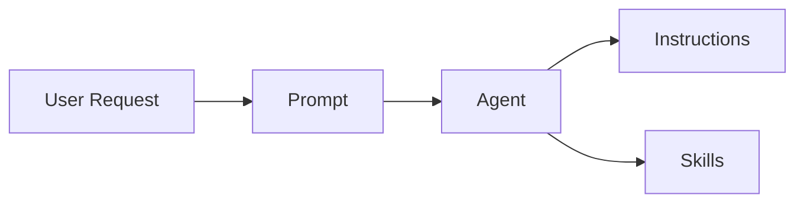
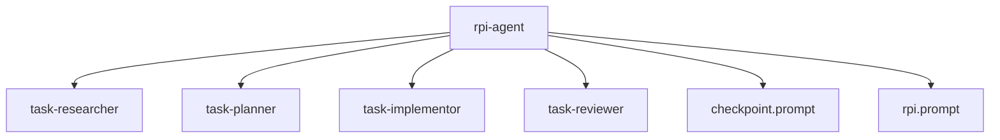

HVE Core provides a four-tier artifact system for customizing GitHub Copilot behavior. Each tier serves a distinct purpose in the delegation chain, enabling structured, reusable AI guidance that flows from user intent to technology-specific standards and executable utilities.

## Artifact Type Hierarchy

The artifact system organizes customizations by scope and responsibility. Prompts handle user interaction, agents orchestrate workflows, instructions encode standards, and skills provide executable utilities.

### Prompts

Prompts (`.prompt.md`) serve as workflow entry points. They capture user intent and translate requests into structured guidance for Copilot execution.

**Core characteristics:**

* Define single-session workflows with clear inputs and outputs
* Accept user inputs through `${input:varName}` template syntax
* Delegate to agents via `agent:` frontmatter references

**Frontmatter structure:**

```yaml
---
description: 'Protocol for creating ADO pull requests'
agent: Task Planner
---
```

Prompts answer the question "what does the user want to accomplish?" and route execution to appropriate agents.

### Agents

Agents (`.agent.md`) define task-specific behaviors with access to Copilot tools. They orchestrate multi-step workflows and make decisions based on context.

**Core characteristics:**

* Specify available tools through `tools:` frontmatter arrays
* Enable workflow handoffs via `handoffs:` references to other agents
* Maintain conversation context across multiple interactions
* Apply domain expertise through detailed behavioral instructions

**Frontmatter structure:**

```yaml
---
description: 'Orchestrates task planning with research integration'
tools: ['codebase', 'search', 'editFiles', 'changes']
handoffs:
  - label: "⚡ Implement"
    agent: Task Implementor
    prompt: /task-implement
    send: true
  - label: "🔬 Research"
    agent: Task Researcher
    prompt: /task-research
    send: true
---
```

Agents answer the question "how should this task be executed?" and coordinate the necessary tools and resources.

### Instructions

Instructions (`.instructions.md`) encode technology-specific standards and conventions. They apply automatically based on file patterns and provide consistent guidance across the codebase.

**Core characteristics:**

* Match files through `applyTo:` glob patterns for automatic application
* Define coding standards, naming conventions, and quality requirements
* Apply to specific languages, frameworks, or file types
* Stack with other instructions when multiple patterns match

**Frontmatter structure:**

```yaml
---
description: 'Python scripting standards with type hints'
applyTo: '**/*.py, **/*.ipynb'
---
```

Instructions answer the question "what standards apply to this context?" and ensure consistent code quality.

#### Repo-Specific Instructions

Instructions placed at the root of `.github/instructions/` (without a subdirectory) are scoped to the hve-core repository itself and MUST NOT be included in collection manifests. These files govern internal repository concerns (CI/CD workflows, repo-specific conventions) that are not applicable outside the repository. Root-level artifacts are intentionally excluded from artifact selection and package composition.

> [!IMPORTANT]
> Root-level files under `.github/instructions/` (no subdirectory) are repo-specific and never distributed. Files in subdirectories like `hve-core/`, `ado/`, and `shared/` are collection-scoped and distributable.

### Skills

Skills (`.github/skills/<name>/SKILL.md`) provide executable utilities that agents invoke for specialized tasks. Unlike instructions (passive reference), skills contain actual scripts that perform operations.

**Core characteristics:**

* Provide self-contained utility packages with documentation and scripts
* Include parallel implementations for cross-platform support (`.sh` and `.ps1`)
* Execute actual operations rather than providing guidance

**Directory structure (by convention):**

```text
.github/skills/{collection-id}/<skill-name>/
├── SKILL.md           # Required entry point with frontmatter
├── scripts/
│   ├── convert.sh     # Bash implementation
│   └── convert.ps1    # PowerShell implementation
└── examples/
    └── README.md      # Usage examples
```

**Frontmatter structure:**

```yaml
---
name: video-to-gif
description: 'Video-to-GIF conversion with FFmpeg optimization'
---
```

**Required frontmatter fields:**

| Field         | Description                                             |
|---------------|---------------------------------------------------------|
| `name`        | Lowercase kebab-case identifier matching directory name |
| `description` | Brief capability description                            |

Maturity is tracked in `collections/*.collection.yml`, not in skill frontmatter. See [Collection Manifests](#collection-manifests) for details.

Skills answer the question "what specialized utility does this task require?" and provide executable capabilities beyond conversational guidance.

**Key distinction from instructions:**

| Aspect     | Instructions                | Skills                |
|------------|-----------------------------|-----------------------|
| Nature     | Passive reference           | Active execution      |
| Content    | Standards and conventions   | Scripts and utilities |
| Activation | Automatic via glob patterns | Explicit invocation   |
| Output     | Guidance for Copilot        | Executed operations   |

## Delegation Flow

The artifact system follows a hierarchical delegation model. User requests flow through prompts to agents, which apply relevant instructions during execution.



**Flow mechanics:**

1. User invokes a prompt through `/prompt` commands or workflow triggers.
2. Prompt references an agent via `agent:` frontmatter, delegating execution.
3. Agent executes with instructions auto-applied based on file context.
4. Agent invokes skills for specialized utilities with executable scripts.

This delegation model separates concerns. Prompts handle user interaction, agents manage orchestration, and instructions provide standards.

## Interface Contracts

Each artifact type defines clear interfaces for interoperability.

### Prompt-to-Agent References

Prompts reference agents through the `agent:` frontmatter field:

```yaml
---
description: 'Create a pull request with work item linking'
agent: 'pr-creator'
---
```

The referenced agent file (`pr-creator.agent.md`) is typically organized under `.github/agents/{collection-id}/` by convention. When a user invokes the prompt, Copilot activates the specified agent with the prompt's context.

### Instruction Glob Patterns

Instructions use `applyTo:` patterns for automatic activation:

| Pattern                      | Matches                              |
|------------------------------|--------------------------------------|
| `**/*.py`                    | All Python files recursively         |
| `**/tests/**/*.ts`           | TypeScript files in test directories |
| `**/.copilot-tracking/pr/**` | PR tracking files                    |

Multiple instructions can apply to the same file. When patterns overlap, all matching instructions contribute guidance. Pattern specificity determines precedence for conflicting directives.

### Skill Entry Points

Skills provide self-contained utilities through the `SKILL.md` file:

```text
.github/skills/{collection-id}/<skill-name>/
├── SKILL.md                    # Entry point documentation
├── convert.sh                  # Bash implementation
├── convert.ps1                 # PowerShell implementation
└── examples/
    └── README.md
```

The `{collection-id}` path segment reflects the conventional organization; artifacts can reside in any subfolder.

Copilot discovers skills automatically when their description matches the current task context. Skills can also be referenced explicitly by name. The skill's `SKILL.md` documents prerequisites, parameters, and usage patterns. Cross-platform scripts ensure consistent behavior across operating systems.

## Collection Manifests

Collection manifests in `collections/*.collection.yml` serve as the source of truth for artifact selection and maturity. They drive packaging for extension collections and contributor workflows without adding maturity metadata to artifact frontmatter.

### Collection Architecture

```text
┌─────────────────────────────────────────────────────────────────────┐
│                     Collection Manifests                             │
│  collections/*.collection.yml                                        │
│  ┌─────────────────────────────────────────────────────────────┐     │
│  │ items[]                                                     │     │
│  │ - path                                                      │     │
│  │ - kind                                                      │     │
│  │ - maturity (optional, defaults to stable)                  │     │
│  └─────────────────────────────────────────────────────────────┘     │
└─────────────────────────────────────────────────────────────────────┘
                              │
                              ▼
┌─────────────────────────────────────────────────────────────────────┐
│                         Build System                                 │
│  ┌─────────────────┐    ┌─────────────────┐                         │
│  │ Collection      │    │ Prepare-        │                         │
│  │ Manifests       │───▶│ Extension.ps1   │                         │
│  │ *.collection.yml     │ -Collection     │                         │
│  └─────────────────┘    └─────────────────┘                         │
└─────────────────────────────────────────────────────────────────────┘
```

### Collection Item Structure

Each collection item defines inclusion metadata for artifact selection and release channel filtering:

```yaml
items:
    - path: .github/agents/hve-core/rpi-agent.agent.md
        kind: agent
        maturity: stable
    - path: .github/prompts/hve-core/task-plan.prompt.md
        kind: prompt
        maturity: preview
```

| Field      | Purpose                                                           |
|------------|-------------------------------------------------------------------|
| `path`     | Repository-relative path to the artifact source                   |
| `kind`     | Artifact type (`agent`, `prompt`, `instruction`, `skill`, `hook`) |
| `maturity` | Optional release channel gating value (`stable` default)          |

### Collection Model

Collections represent role-targeted artifact packages. Collection manifests select artifacts for those roles.

| Collection    | Identifier     | Target Users        |
|---------------|----------------|---------------------|
| **All**       | `hve-core-all` | Universal inclusion |
| **Developer** | `developer`    | Software engineers  |

Artifacts assigned to `hve-core-all` appear in the full collection and may also include role-specific collections for targeted distribution.

### Collection Build System

Collections define role-filtered artifact packages. Each collection manifest specifies which artifacts to include and controls release channel eligibility through a `maturity` field:

```json
{
    "id": "developer",
    "name": "hve-developer",
    "displayName": "HVE Core - Developer Edition",
    "description": "AI-powered coding agents curated for software engineers",
    "maturity": "stable",
    "items": ["developer"]
}
```

The build system resolves collections by:

1. Reading the collection manifest to identify target artifacts
2. Checking collection-level maturity against the target release channel
3. Filtering collection items by path/kind membership
4. Including the `hve-core-all` collection artifacts as the base
5. Adding collection-specific artifacts
6. Resolving dependencies for included artifacts

#### Collection Maturity

Collections carry their own maturity level, independent of artifact-level maturity. This controls whether the entire collection is built for a given release channel:

| Collection Maturity | PreRelease Channel | Stable Channel |
|---------------------|--------------------|----------------|
| `stable`            | Included           | Included       |
| `preview`           | Included           | Included       |
| `experimental`      | Included           | Excluded       |
| `deprecated`        | Excluded           | Excluded       |

New collections should start as `experimental` until validated, then transition to `stable` by changing a single field. The `maturity` field is optional and defaults to `stable` when omitted.

### Dependency Resolution

Agents may declare dependencies on other artifacts through the `requires` field. The dependency resolver ensures complete artifact graphs are installed:



When installing `rpi-agent`, all dependent agents and prompts are automatically included regardless of collection filter.

## Extension Integration

The VS Code extension discovers and activates AI artifacts through contribution points.

### Discovery Mechanism

The extension scans these directories at startup:

* `.github/prompts/{collection-id}/` for workflow entry points
* `.github/agents/{collection-id}/` for specialized behaviors
* `.github/instructions/{collection-id}/` for technology standards
* `.github/skills/{collection-id}/` for utility packages

These paths reflect the conventional directory structure. Artifact inclusion is controlled by `collections/*.collection.yml`, and collection manifests can reference artifacts from any subfolder. Root-level artifacts (files directly under `.github/{type}/` with no subdirectory) are repo-specific, excluded from discovery, and never packaged into extension builds.

| Maturity       | Stable Channel | Pre-release Channel |
|----------------|----------------|---------------------|
| `stable`       | Included       | Included            |
| `preview`      | Excluded       | Included            |
| `experimental` | Excluded       | Included            |
| `deprecated`   | Excluded       | Excluded            |

The maturity table above applies to individual artifacts. Collections also carry a `maturity` field that gates the entire package at the channel level (see [Collection Maturity](#collection-maturity)).

### Collection Packages

Multiple extension packages can be built from the same codebase:

| Collection | Extension ID                       | Contents                    |
|------------|------------------------------------|-----------------------------|
| Full       | `ise-hve-essentials.hve-core`      | All stable artifacts        |
| Developer  | `ise-hve-essentials.hve-developer` | Developer-focused artifacts |

Users install the collection matching their role for a curated experience.

### Activation Context

Instructions activate based on the current file's path matching `applyTo:` patterns. Prompts and agents activate through explicit user invocation. Skills activate when agents or users request their utilities.

The extension provides these contribution points:

* `/prompt <name>` invokes prompts by filename.
* Agents activate through prompt references or direct invocation.
* Matching instructions inject into Copilot context automatically.

## Deprecated Artifacts

Artifacts that have been superseded or are scheduled for removal live under `.github/deprecated/{type}/`, preserving the same type subdirectories used by active artifacts.

### Location

```text
.github/deprecated/
├── agents/         # Superseded agent files
├── instructions/   # Retired instruction files
├── prompts/        # Retired prompt files
└── skills/         # Retired skill packages
```

### Automatic Exclusion

The build system excludes `.github/deprecated/` contents from all downstream surfaces:

| Surface              | Exclusion Mechanism                         |
|----------------------|---------------------------------------------|
| Collection manifests | `Update-HveCoreAllCollection` path filter   |
| Plugin generation    | `Get-ArtifactFiles` path filter             |
| Extension packaging  | Discovery function `deprecated` path filter |
| VS Code activation   | Not discovered at runtime                   |

No manual removal from manifests is required when an artifact moves to `.github/deprecated/`. The path-based exclusion operates independently of `maturity` metadata, providing a reliable safety net against silent reintroduction.

### Retention and Removal

Deprecated artifacts remain in the repository for traceability and migration guidance. Each deprecated file SHOULD contain a frontmatter note or heading that identifies its replacement. Permanent removal occurs at a planned retirement window with a corresponding changelog entry.

### When to Deprecate

Move an artifact to `.github/deprecated/{type}/` when:

* A newer artifact fully replaces its functionality
* The artifact is no longer maintained or tested
* The artifact targets a retired platform or workflow

## Related Documentation

* [Agent Systems Catalog](../agents/README.md) - Overview of all agent systems with workflow documentation
* [AI Artifacts Common Standards](../contributing/ai-artifacts-common.md) - Quality requirements for all artifacts
* [Contributing Prompts](../contributing/prompts.md) - Prompt file specifications
* [Contributing Agents](../contributing/custom-agents.md) - Agent file specifications
* [Contributing Instructions](../contributing/instructions.md) - Instruction file specifications
* [Contributing Skills](../contributing/skills.md) - Skill package specifications

🤖 *Crafted with precision by ✨Copilot following brilliant human instruction, then carefully refined by our team of discerning human reviewers.*
