HVE Core uses GitHub Actions for continuous integration, quality validation, security scanning, and release automation. The workflow architecture emphasizes reusable components and parallel execution for fast feedback.

## Pipeline Overview

## Workflow Inventory

| Workflow                           | Trigger                 | Purpose                                         |
|------------------------------------|-------------------------|-------------------------------------------------|
| `pr-validation.yml`                | Pull request, manual    | Pre-merge quality gate with parallel validation |
| `main.yml`                         | Push to main, manual    | Post-merge validation and release automation    |
| `weekly-security-maintenance.yml`  | Sunday 2 AM UTC, manual | Scheduled security posture review               |
| `security-scan.yml`                | Push to main/develop    | CodeQL security validation                      |
| `extension-publish.yml`            | Manual                  | VS Code extension marketplace publishing        |
| `extension-publish-prerelease.yml` | Manual                  | VS Code extension pre-release publishing        |
| `copilot-setup-steps.yml`          | Manual                  | Coding agent environment setup                  |
| `prerelease-release.yml`           | PR closed               | Pre-release tag and publish on merge to main    |
| `prerelease.yml`                   | Push to main            | Pre-release companion PR management             |
| `scorecard.yml`                    | Schedule, push          | OpenSSF Scorecard security analysis             |
| `codeql-analysis.yml`              | Schedule                | Weekly CodeQL security scan (also reusable)     |
| `dependency-review.yml`            | Pull request            | Dependency vulnerability review (also reusable) |
| `sha-staleness-check.yml`          | Manual                  | SHA reference freshness check (also reusable)   |

### Reusable Workflows

Individual validation workflows called by orchestration workflows:

| Workflow                            | Purpose                          | npm Script                          |
|-------------------------------------|----------------------------------|-------------------------------------|
| `markdown-lint.yml`                 | Markdownlint validation          | `npm run lint:md`                   |
| `spell-check.yml`                   | cspell dictionary check          | `npm run spell-check`               |
| `frontmatter-validation.yml`        | AI artifact frontmatter schemas  | `npm run lint:frontmatter`          |
| `markdown-link-check.yml`           | Broken link detection            | `npm run lint:md-links`             |
| `link-lang-check.yml`               | Link language validation         | `npm run lint:links`                |
| `yaml-lint.yml`                     | YAML syntax validation           | `npm run lint:yaml`                 |
| `ps-script-analyzer.yml`            | PowerShell static analysis       | `npm run lint:ps`                   |
| `table-format.yml`                  | Markdown table formatting        | `npm run format:tables`             |
| `pester-tests.yml`                  | PowerShell unit tests            | `npm run test:ps`                   |
| `skill-validation.yml`              | Skill structure validation       | `npm run validate:skills`           |
| `dependency-pinning-scan.yml`       | GitHub Actions pinning           | N/A (PowerShell direct)             |
| `sha-staleness-check.yml`           | SHA reference freshness*         | N/A (PowerShell direct)             |
| `codeql-analysis.yml`               | CodeQL security scanning*        | N/A (GitHub native)                 |
| `dependency-review.yml`             | Dependency vulnerability review* | N/A (GitHub native)                 |
| `extension-package.yml`             | VS Code extension packaging      | `npm run extension:package`         |
| `copyright-headers.yml`             | Copyright header validation      | `npm run validate:copyright`        |
| `gitleaks-scan.yml`                 | Secret detection scanning        | N/A (gitleaks direct)               |
| `plugin-package.yml`                | Plugin collection packaging      | N/A                                 |
| `plugin-validation.yml`             | Plugin and collection metadata   | `npm run lint:collections-metadata` |
| `extension-publish-marketplace.yml` | Extension marketplace publishing | N/A                                 |

Workflows marked with `*` are dual-purpose: they accept `workflow_call` for reuse by orchestration workflows and also run independently via their own triggers.

## PR Validation Pipeline

The `pr-validation.yml` workflow serves as the primary quality gate for all pull requests. It runs 16 parallel jobs covering linting, security, and testing.

### Jobs

| Job                      | Reusable Workflow             | Validates                      |
|--------------------------|-------------------------------|--------------------------------|
| spell-check              | `spell-check.yml`             | Spelling across all files      |
| markdown-lint            | `markdown-lint.yml`           | Markdown formatting rules      |
| table-format             | `table-format.yml`            | Markdown table structure       |
| psscriptanalyzer         | `ps-script-analyzer.yml`      | PowerShell code quality        |
| yaml-lint                | `yaml-lint.yml`               | YAML syntax                    |
| pester-tests             | `pester-tests.yml`            | PowerShell unit tests          |
| frontmatter-validation   | `frontmatter-validation.yml`  | AI artifact metadata           |
| skill-validation         | `skill-validation.yml`        | Skill directory structure      |
| link-lang-check          | `link-lang-check.yml`         | Link accessibility             |
| markdown-link-check      | `markdown-link-check.yml`     | Broken links                   |
| dependency-pinning-check | `dependency-pinning-scan.yml` | Action SHA pinning             |
| npm-audit                | Inline                        | npm dependency vulnerabilities |
| codeql                   | `codeql-analysis.yml`         | Code security patterns         |
| copyright-headers        | `copyright-headers.yml`       | Copyright header compliance    |
| plugin-validation        | `plugin-validation.yml`       | Plugin and collection metadata |
| gitleaks-scan            | `gitleaks-scan.yml`           | Secret detection               |

All jobs run in parallel with no dependencies, enabling fast feedback (typically under 3 minutes).

## Main Branch Pipeline

The `main.yml` workflow runs after merges to main, performing validation and release automation.

```mermaid
flowchart LR
    V1[spell-check] --> RP[release-please]
    V2[markdown-lint] --> RP
    V3[table-format] --> RP
    V4[dependency-pinning-scan] --> RP
    V5[gitleaks-scan] --> RP
    V6[pester-tests] --> RP
    RP --> RST[reset-prerelease]
    RP -->|release_created| EPR[extension-package-release]
    RP -->|release_created| PPR[plugin-package-release]
    RP -->|release_created| SBOM[generate-dependency-sbom]
    EPR --> ATT[attest-and-upload]
    SBOM --> ATT
    PPR --> UPP[upload-plugin-packages]
    SBOM --> SD[sbom-diff]
    ATT --> PUB[publish-release]
    UPP --> PUB
    SD --> PUB
    style RP fill:#f9f,stroke:#333
```

Release-please v4 handles `chore`-type commits natively. They are not releasable and do not produce spurious release PRs, so no commit-message guard is needed.

### Main Branch Jobs

| Job                       | Purpose                        | Dependencies                                                         |
|---------------------------|--------------------------------|----------------------------------------------------------------------|
| spell-check               | Post-merge spelling validation | None                                                                 |
| markdown-lint             | Post-merge markdown validation | None                                                                 |
| table-format              | Post-merge table validation    | None                                                                 |
| dependency-pinning-scan   | Security pinning check         | None                                                                 |
| gitleaks-scan             | Secret detection scanning      | None                                                                 |
| pester-tests              | PowerShell unit tests          | None                                                                 |
| release-please            | Automated release management   | All validation jobs                                                  |
| reset-prerelease          | Reset pre-release tracking     | release-please                                                       |
| extension-package-release | Build release VSIX             | release-please (conditional)                                         |
| plugin-package-release    | Build release plugin packages  | release-please (conditional)                                         |
| generate-dependency-sbom  | Generate dependency SBOM       | release-please (conditional)                                         |
| attest-and-upload         | Sign and upload VSIX           | release-please, extension-package-release, generate-dependency-sbom  |
| upload-plugin-packages    | Upload plugin packages         | release-please, plugin-package-release                               |
| sbom-diff                 | Compare SBOM changes           | release-please, generate-dependency-sbom                             |
| publish-release           | Finalize GitHub Release        | release-please, attest-and-upload, upload-plugin-packages, sbom-diff |

When release-please creates a release, parallel jobs build the extension VSIX (`extension-package-release`), package plugin collections (`plugin-package-release`), and generate an SBOM (`generate-dependency-sbom`). The `attest-and-upload` job signs the VSIX with Sigstore attestation, `upload-plugin-packages` uploads collection artifacts, and `sbom-diff` compares dependency changes. The `publish-release` job finalizes the GitHub Release after all artifacts are ready.

## Security Workflows

### Weekly Security Maintenance

The `weekly-security-maintenance.yml` workflow runs every Sunday at 2AM UTC, providing scheduled security posture review.

| Job              | Purpose                               |
|------------------|---------------------------------------|
| validate-pinning | Verify GitHub Actions use SHA pinning |
| check-staleness  | Detect outdated SHA references        |
| codeql-analysis  | Full CodeQL security scan             |
| summary          | Aggregate security status report      |

### Security Validation Tools

| Tool               | Script                       | Checks                                   |
|--------------------|------------------------------|------------------------------------------|
| Dependency Pinning | `Test-DependencyPinning.ps1` | Actions use SHA refs, not tags           |
| SHA Staleness      | `Test-SHAStaleness.ps1`      | SHAs reference recent commits            |
| npm Audit          | `npm audit`                  | Known vulnerabilities in dependencies    |
| CodeQL             | GitHub native                | Code patterns indicating security issues |
| Gitleaks           | `gitleaks`                   | Secret detection in repository history   |
| Dependency Review  | GitHub native                | Dependency vulnerability analysis        |

## Extension Publishing

The `extension-publish.yml` and `extension-publish-prerelease.yml` workflows handle VS Code extension marketplace publishing through manual dispatch. Both workflows use collection-based packaging to produce and publish a separate VSIX per collection.

### Publishing Jobs

| Job               | Purpose                                                     | Workflow                           |
|-------------------|-------------------------------------------------------------|------------------------------------|
| normalize-version | Ensure version consistency                                  | `extension-publish.yml`            |
| validate-version  | Enforce odd minor version for pre-release channel           | `extension-publish-prerelease.yml` |
| package (matrix)  | Build one VSIX per collection using `extension-package.yml` | Both                               |
| publish (matrix)  | Upload each VSIX to VS Code Marketplace via OIDC + vsce     | Both                               |

### Collection-Based Packaging

Collection manifests in `collections/*.collection.yml` define collection-scoped subsets of the full artifact set. The `extension-package.yml` reusable workflow discovers these manifests, filters by maturity and channel, and packages each as an independent VSIX.

| Collection     | Maturity     | Included In        |
|----------------|--------------|--------------------|
| `hve-core-all` | Stable       | Stable, PreRelease |
| `developer`    | Experimental | PreRelease only    |

Maturity filtering rules:

* **Deprecated** collections are always excluded.
* **Experimental** collections are excluded from Stable channel builds.
* **Stable** collections are included in all channel builds.

### Version Channels

| Channel     | Version Pattern    | Marketplace      |
|-------------|--------------------|------------------|
| Stable      | Even minor (1.2.0) | Main listing     |
| Pre-release | Odd minor (1.3.0)  | Pre-release flag |

## npm Script Mapping

Workflows invoke validation through npm scripts defined in `package.json`:

| npm Script                     | Command                                     | Used By                    |
|--------------------------------|---------------------------------------------|----------------------------|
| `lint:md`                      | `markdownlint-cli2`                         | markdown-lint.yml          |
| `lint:md:fix`                  | `markdownlint-cli2 --fix`                   | Local                      |
| `spell-check`                  | `cspell`                                    | spell-check.yml            |
| `spell-check:fix`              | `cspell --show-suggestions`                 | Local                      |
| `lint:frontmatter`             | `Validate-MarkdownFrontmatter.ps1`          | frontmatter-validation.yml |
| `lint:md-links`                | `Markdown-Link-Check.ps1`                   | markdown-link-check.yml    |
| `lint:links`                   | `Invoke-LinkLanguageCheck.ps1`              | link-lang-check.yml        |
| `lint:yaml`                    | `Invoke-YamlLint.ps1`                       | yaml-lint.yml              |
| `lint:ps`                      | `Invoke-PSScriptAnalyzer.ps1`               | ps-script-analyzer.yml     |
| `lint:collections-metadata`    | `Validate-Collections.ps1`                  | plugin-validation.yml      |
| `lint:marketplace`             | `Validate-Marketplace.ps1`                  | plugin-validation.yml      |
| `lint:version-consistency`     | `Test-ActionVersionConsistency.ps1`         | Local                      |
| `lint:all`                     | Chains all linters                          | Local                      |
| `format:tables`                | `markdown-table-formatter`                  | table-format.yml           |
| `test:ps`                      | `Invoke-PesterTests.ps1`                    | pester-tests.yml           |
| `validate:skills`              | `Validate-SkillStructure.ps1`               | skill-validation.yml       |
| `validate:copyright`           | `Test-CopyrightHeaders.ps1`                 | copyright-headers.yml      |
| `extension:prepare`            | `Prepare-Extension.ps1`                     | extension-package.yml      |
| `extension:prepare:prerelease` | `Prepare-Extension.ps1 -Channel PreRelease` | extension-package.yml      |
| `extension:package`            | `Package-Extension.ps1`                     | extension-package.yml      |
| `package:extension`            | Alias for `extension:package`               | extension-package.yml      |
| `extension:package:prerelease` | `Package-Extension.ps1 -PreRelease`         | extension-package.yml      |
| `plugin:generate`              | `Generate-Plugins.ps1` + post-process       | plugin-package.yml         |
| `plugin:validate`              | Alias for `lint:collections-metadata`       | plugin-validation.yml      |

## Related Documentation

* [Testing Architecture](testing.md) - PowerShell Pester test infrastructure
* [Scripts README](https://github.com/microsoft/hve-core/blob/main/scripts/README.md) - Script organization and usage

🤖 *Crafted with precision by ✨Copilot following brilliant human instruction, then carefully refined by our team of discerning human reviewers.*
