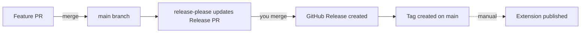
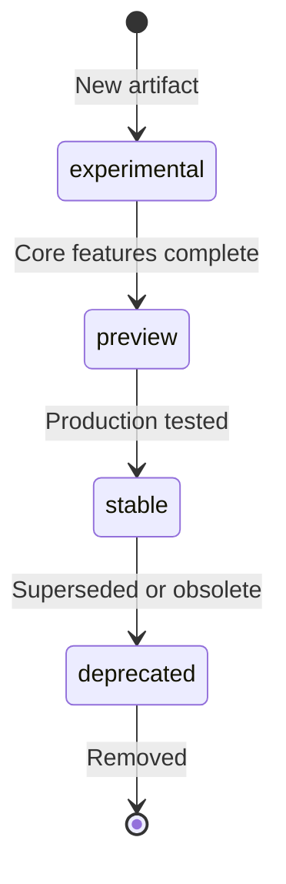

## Overview

This project uses trunk-based development with automated release management. All changes go directly to `main` via pull requests, and [release-please](https://github.com/googleapis/release-please) handles version bumping, changelog generation, and GitHub releases automatically.

## How Releases Work



When you merge a PR to `main`:

1. **release-please analyzes commits** using conventional commit messages
2. **Updates the Release PR** with version bumps and changelog entries
3. **You decide** when to merge the Release PR
4. **Merging creates** a GitHub Release with the changelog
5. **Extension publishing** is a separate manual step

## The Release PR

The Release PR is not a branch cut or deployment. It is a staging mechanism containing only version metadata changes:

* Updated `package.json` version
* Updated `extension/templates/package.template.json` version
* Updated `CHANGELOG.md`

Your actual code changes are already on `main` from your feature PRs. The Release PR accumulates version and changelog updates until you are ready to release.

### Version Calculation

Release-please determines the version bump from commit prefixes:

| Commit Prefix                  | Version Bump | Example              |
|--------------------------------|--------------|----------------------|
| `feat:`                        | Minor        | 1.0.0 → 1.1.0        |
| `fix:`                         | Patch        | 1.0.0 → 1.0.1        |
| `feat!:` or `BREAKING CHANGE:` | Major        | 1.0.0 → 2.0.0        |
| `docs:`, `chore:`, `refactor:` | No bump      | Grouped in changelog |

## For Contributors

Write commits using conventional commit format. This enables automated changelog generation and version bumping.

```bash
# Features (triggers minor version bump)
git commit -m "feat: add new prompt for code review"

# Bug fixes (triggers patch version bump)
git commit -m "fix: resolve parsing error in instruction files"

# Documentation (no version bump, appears in changelog)
git commit -m "docs: update installation guide"

# Breaking changes (triggers major version bump)
git commit -m "feat!: redesign configuration schema"
```

For more details, see the [commit message instructions](../../.github/instructions/hve-core/commit-message.instructions.md).

## For Maintainers

### Reviewing the Release PR

The Release PR titled "chore(main): release X.Y.Z" updates automatically as PRs merge. When ready to release:

1. Review the accumulated changelog in the PR
2. Verify version bump is appropriate for the changes
3. Merge the Release PR
4. A GitHub Release is created automatically with the changelog

### Release Cadence

Releases are on-demand. Merge the Release PR when:

* A meaningful set of changes has accumulated
* A critical fix needs immediate release
* A scheduled release milestone is reached

There is no requirement to release after every PR merge.

## Extension Publishing

VS Code extension publishing is manual via GitHub Actions workflow dispatch.

### Publishing Steps

1. Navigate to **Actions → Publish Extension** in the repository (see [extension-publish.yml](../../.github/workflows/extension-publish.yml) for workflow details)
2. Select **Run workflow**
3. Choose the `main` branch
4. Optionally specify a version (defaults to `package.json` version)
5. Optionally enable dry-run mode to package without publishing
6. Click **Run workflow**

The workflow packages the extension and publishes to the VS Code Marketplace using Azure OIDC authentication.

### When to Publish

Publish the extension after merging a Release PR that includes extension-relevant changes:

* New prompts, instructions, or custom agents
* Bug fixes affecting extension behavior
* Updated extension metadata or documentation

Documentation-only releases may not require an extension publish.

## Version Quick Reference

| Action                   | Result                                      |
|--------------------------|---------------------------------------------|
| Merge feature PR to main | Release PR updates with new changelog entry |
| Merge Release PR         | GitHub Release created, tag applied         |
| Run publish workflow     | Extension published to marketplace          |
| Merge docs-only PR       | Changelog updated, no version bump          |

## Extension Channels and Maturity

The VS Code extension is published to two channels with different stability expectations.

### Extension Channels

| Channel     | Stability        | Included Maturity Levels            | Audience       |
|-------------|------------------|-------------------------------------|----------------|
| Stable      | Production-ready | `stable` only                       | All users      |
| Pre-release | Early access     | `stable`, `preview`, `experimental` | Early adopters |

### Maturity Levels

Each prompt, instruction, agent, and skill can set `maturity` in `collections/*.collection.yml` under `items[]`:

| Level          | Description                                     | Included In         |
|----------------|-------------------------------------------------|---------------------|
| `stable`       | Production-ready, fully tested                  | Stable, Pre-release |
| `preview`      | Feature-complete but may have rough edges       | Pre-release only    |
| `experimental` | Early development, may change significantly     | Pre-release only    |
| `deprecated`   | Scheduled for removal, excluded from all builds | Neither             |

### Maturity Lifecycle



### Contributor Guidelines

| Guideline          | Action                                                                                                                                                                                                                                                                                                                                    |
|--------------------|-------------------------------------------------------------------------------------------------------------------------------------------------------------------------------------------------------------------------------------------------------------------------------------------------------------------------------------------|
| New contributions  | Set `stable` on collection items unless explicitly targeting early adopters                                                                                                                                                                                                                                                               |
| Experimental work  | Set `experimental` on collection items for proof-of-concept or rapidly evolving artifacts                                                                                                                                                                                                                                                 |
| Preview promotions | Set `preview` on collection items when core functionality is complete                                                                                                                                                                                                                                                                     |
| Stable promotions  | Set `stable` on collection items after production validation                                                                                                                                                                                                                                                                              |
| Deprecation        | Set `deprecated` on collection items before removal to provide transition time. Move the artifact file to `.github/deprecated/{type}/` so the build system excludes it from all downstream surfaces automatically. See [AI Artifacts Architecture](../architecture/ai-artifacts.md#deprecated-artifacts) for the full deprecation policy. |

---

<!-- markdownlint-disable MD036 -->
*🤖 Crafted with precision by ✨Copilot following brilliant human instruction,
then carefully refined by our team of discerning human reviewers.*
<!-- markdownlint-enable MD036 -->
