Design Thinking is a nine-method, three-space framework for human-centered design. The [DT Coach](dt-coach.md) agent guides you through each method, helping you discover real problems, develop validated solutions, and prepare implementation specifications, all within GitHub Copilot.

## Why Use Design Thinking?

Most projects fail not because the code is wrong, but because the team solved the wrong problem. Design Thinking ensures you understand your users and their needs before writing a single line of code.

> [!TIP]
> **Key Benefits**
>
> * Discovers the real problem behind solution requests.
> * Validates concepts with stakeholders before committing to implementation.
> * Produces structured handoff artifacts that feed directly into [RPI workflows](../rpi/README.md).
> * Applies across industries: manufacturing, healthcare, energy, and more.

**Want the full explanation?** See [Why Design Thinking?](why-design-thinking.md) for in-depth rationale and comparisons with traditional requirements gathering.

## Design Thinking Flow

```mermaid
flowchart LR
    subgraph problem["Problem Space — rough / exploratory"]
        M1["1 · Scope<br/>Conversations"] --> M2["2 · Design<br/>Research"] --> M3["3 · Input<br/>Synthesis"]
    end

    subgraph solution["Solution Space — scrappy / concept-grade"]
        M4["4 · Brain-<br/>storming"] --> M5["5 · User<br/>Concepts"] --> M6["6 · Lo-Fi<br/>Prototypes"]
    end

    subgraph validation["Validation Space — functionally rigorous"]
        M7["7 · Hi-Fi<br/>Prototypes"] --> M8["8 · User<br/>Testing"] --> M9["9 · Iteration<br/>at Scale"]
    end

    M3 --> M4
    M6 --> M7

    M3 -.->|"Exit 1 · problem statement"| TR["Task Researcher"]
    M6 -.->|"Exit 2 · validated concept"| TR
    M9 -.->|"Exit 3 · implementation spec"| TR

    TR -.->|"return signal"| M1
```

Each exit point produces a handoff artifact with confidence markers and a stakeholder map. RPI agents can also return work to DT when assumptions need revision. See [DT to RPI Integration](dt-rpi-integration.md) for details.

## The Three Spaces

Design Thinking organizes work into three spaces, each with a distinct purpose and quality standard.

### 🔍 Problem Space (Methods 1-3)

Understand who you are solving for and what they actually need. Outputs are rough and exploratory.

* Method 1: Scope Conversations discovers real problems behind solution requests
* Method 2: Design Research provides systematic stakeholder research and observation
* Method 3: Input Synthesis performs pattern recognition and theme development

### 💡 Solution Space (Methods 4-6)

Generate and validate ideas at low fidelity. Outputs are scrappy and concept-grade. Polish is explicitly discouraged.

* Method 4: Brainstorming applies divergent ideation on validated problems
* Method 5: User Concepts enables visual concept validation
* Method 6: Low-Fidelity Prototypes drive scrappy constraint discovery

### 🔧 Validation Space (Methods 7-9)

Build functional prototypes, test with users, and scale. Outputs are functionally rigorous without visual polish.

* Method 7: High-Fidelity Prototypes verifies technical feasibility
* Method 8: User Testing performs systematic validation and iteration
* Method 9: Iteration at Scale drives continuous optimization and deployment

## Method Overview

| Method | Name                     | Space      | Key Output                  |
|--------|--------------------------|------------|-----------------------------|
| 1      | Scope Conversations      | Problem    | Validated problem scope     |
| 2      | Design Research          | Problem    | Stakeholder insights        |
| 3      | Input Synthesis          | Problem    | Problem statement           |
| 4      | Brainstorming            | Solution   | Idea clusters               |
| 5      | User Concepts            | Solution   | Visual concept boards       |
| 6      | Low-Fidelity Prototypes  | Solution   | Scrappy prototypes          |
| 7      | High-Fidelity Prototypes | Validation | Functional prototypes       |
| 8      | User Testing             | Validation | Validated designs           |
| 9      | Iteration at Scale       | Validation | Deployment-ready refinement |

## Getting Started

Use the [DT Coach](dt-coach.md) agent to start a guided Design Thinking session. The coach walks you through each method, manages session state, and enforces quality standards appropriate to each space.

## Integration with RPI

Design Thinking outputs feed directly into the RPI (Research, Plan, Implement, Review) pipeline. When your DT session reaches a natural exit point, the coach prepares a structured handoff artifact that Task Researcher receives and processes before passing findings through the standard RPI pipeline to Planner and Implementor.

* [Tutorial: Handing Off from DT to RPI](tutorial-handoff-to-rpi.md): Step-by-step guide with practical examples at each exit point
* [DT to RPI Integration](dt-rpi-integration.md): Reference for the handoff contract, per-agent mappings, and confidence markers

## Learn at Your Own Pace

The [DT Learning Tutor](dt-learning-tutor.md) provides curriculum-based training across all nine methods with exercises, checks, and reference scenarios.

> Brought to you by microsoft/hve-core

<!-- markdownlint-disable MD036 -->
*🤖 Crafted with precision by ✨Copilot following brilliant human instruction,
then carefully refined by our team of discerning human reviewers.*
<!-- markdownlint-enable MD036 -->
