Design Thinking and RPI connect through structured handoff artifacts. When a DT session reaches a natural exit point, the DT Coach prepares an artifact containing validated findings, confidence markers, and stakeholder maps that RPI agents consume as input.

## Handoff Pipeline Overview

```mermaid
flowchart TD
    DT["DT Coach Session"]

    subgraph problem["Problem Space"]
        M13["Methods 1-3<br/>Scope · Research · Synthesis"]
    end

    subgraph solution["Solution Space"]
        M46["Methods 4-6<br/>Brainstorm · Concepts · Lo-Fi Prototypes"]
    end

    subgraph validate["Validation Space"]
        M79["Methods 7-9<br/>Hi-Fi Prototypes · Testing · Iteration"]
    end

    DT --> M13 --> M46 --> M79

    M13 -.->|"Exit 1 · problem statement complete"| TR["Task Researcher"]
    M46 -.->|"Exit 2 · concept validated"| TR
    M79 -.->|"Exit 3 · implementation spec ready"| TR

    TR --> TP["Task Planner"] --> TI["Task Implementor"]
    TR -.->|"return when DT assumptions need revision"| DT
```

Each exit point produces a handoff artifact with the same schema: artifact paths, confidence markers (`validated`, `assumed`, `unknown`, `conflicting`), and a stakeholder map.

## Exit Points

### Problem Statement Complete (Methods 1-3 → Task Researcher)

After completing Scope Conversations, Design Research, and Input Synthesis, the team has a validated problem statement backed by multi-source evidence. Task Researcher uses this framing to:

* Scope technical research around stakeholder-validated needs rather than assumed requirements
* Treat `assumed` items as verification targets
* Treat `unknown` items as primary research targets
* Investigate from each stakeholder perspective identified in the handoff

### Concept Validated (Methods 4-6 → Task Researcher)

After Brainstorming, User Concepts, and Low-Fidelity Prototypes, the team has a stakeholder-validated concept with known constraints. Task Researcher receives these richer artifacts to:

* Validate the narrowed solution directions through technical investigation
* Resolve constraints marked `assumed` or `unknown` from lo-fi prototype testing
* Assess feasibility of tested concepts across stakeholder perspectives
* Investigate integration and scaling concerns before planning begins

### Implementation Spec Ready (Methods 7-9 → Task Researcher)

After High-Fidelity Prototypes and User Testing, the team has functionally validated specifications. Task Researcher receives the richest artifact set to:

* Investigate production readiness, scaling gaps, and integration concerns
* Verify items where testing evidence was limited or conflicting
* Assess whether architecture decisions hold under production constraints
* Narrow research scope significantly because extensive DT validation already occurred

## Per-Agent Input Mapping

Each RPI agent applies DT-specific adjustments when it receives a handoff artifact.

### Task Researcher

| Standard Behavior               | DT-Informed Behavior                                 |
|---------------------------------|------------------------------------------------------|
| Technical feasibility focus     | Stakeholder impact and technical feasibility         |
| Single-perspective analysis     | Multi-stakeholder analysis across roles and contexts |
| Binary findings (works/doesn't) | Quality-marked findings (validated/assumed/unknown)  |
| Forward-only to planner         | May return to DT coach when findings warrant it      |

When research reveals that the DT problem statement needs revision, fundamental assumptions are invalidated, or unrepresented stakeholders emerge, the researcher recommends returning to DT coaching rather than proceeding to planning.

Source: direct from DT handoff.

### Task Planner

| Standard Behavior               | DT-Informed Behavior                                        |
|---------------------------------|-------------------------------------------------------------|
| Production-quality deliverables | Space-appropriate fidelity (rough/scrappy/functional)       |
| Linear phase execution          | Iteration-aware phases with return paths to earlier methods |
| Technical success criteria      | Stakeholder-segmented success criteria                      |
| Forward-only validation         | Validation incorporating DT coach return triggers           |

Plans include a DT Reconnection phase that assesses whether findings warrant returning to DT coaching before downstream implementation.

Source: indirect, via upstream Researcher output.

### Task Implementor

| Standard Behavior            | DT-Informed Behavior                                        |
|------------------------------|-------------------------------------------------------------|
| Production-quality code      | Space-appropriate fidelity                                  |
| Complete feature delivery    | Constraint-validated scope matching DT prototype specs      |
| Technical correctness focus  | Stakeholder experience validation alongside correctness     |
| Full polish and optimization | Anti-polish: functional core without premature optimization |

The implementor enforces fidelity constraints from the originating DT space and references DT artifact paths in implementation logs.

Source: indirect, via upstream Researcher→Planner pipeline chain.

### Task Reviewer

| Standard Behavior        | DT-Informed Behavior                              |
|--------------------------|---------------------------------------------------|
| Code correctness focus   | Coaching quality and method fidelity focus        |
| Pass/fail assessment     | Space-appropriate fidelity assessment             |
| Style guide conformance  | Think/Speak/Empower coaching identity conformance |
| Single output evaluation | Multi-stakeholder coverage evaluation             |

The reviewer checks that all identified stakeholder groups are represented, confidence markers are applied correctly, and output fidelity matches the originating space.

## Confidence Markers

Every handoff artifact tags its contents with confidence markers that downstream agents use to calibrate their work:

| Marker        | Meaning                                 | Downstream Treatment                         |
|---------------|-----------------------------------------|----------------------------------------------|
| `validated`   | Confirmed through multi-source evidence | Treat as reliable input                      |
| `assumed`     | Believed true but not yet verified      | Include verification steps                   |
| `unknown`     | Information gap requiring investigation | Primary research or resolution target        |
| `conflicting` | Evidence points in multiple directions  | Must resolve before downstream work proceeds |

## Iteration Support

The DT-to-RPI handoff is not one-way. When the Researcher encounters issues that trace back to DT assumptions, it recommends returning to DT coaching:

* Task Researcher returns directly to DT Coach when the problem statement needs revision, unrepresented stakeholders emerge, or fundamental assumptions are invalidated.
* Task Planner and Task Implementor surface DT-related issues through the standard RPI chain back to the Researcher, who may recommend returning to DT.
* Task Reviewer flags items that need DT method re-entry based on artifact quality criteria.

> [!TIP]
> Returning to DT from RPI is a sign of thoroughness, not failure. The integration is designed for non-linear iteration across both frameworks.

## Shared Prompts

Three prompts compile DT artifacts for the single RPI entry point at Task Researcher:

* `dt-handoff-problem-space.prompt.md`: Packages Problem Space artifacts (Methods 1-3) for Task Researcher
* `dt-handoff-solution-space.prompt.md`: Packages Solution Space artifacts (Methods 4-6) for Task Researcher
* `dt-handoff-implementation-space.prompt.md`: Packages Validation Space artifacts (Methods 7-9) for Task Researcher

Each prompt collects the relevant method outputs, confidence markers, and open questions into a structured handoff that Task Researcher consumes directly. Later exit prompts produce richer artifacts that narrow the Researcher's investigation scope.

## Related Resources

* [Tutorial: Handing Off from DT to RPI](tutorial-handoff-to-rpi.md): Step-by-step guide with practical examples at each exit point
* [Design Thinking Guide](README.md): Overview of all nine methods and three spaces
* [DT Coach Guide](dt-coach.md): How to use the DT Coach agent
* [RPI Workflow](../rpi/README.md): Research, Plan, Implement, Review framework

> Brought to you by microsoft/hve-core

<!-- markdownlint-disable MD036 -->
*🤖 Crafted with precision by ✨Copilot following brilliant human instruction,
then carefully refined by our team of discerning human reviewers.*
<!-- markdownlint-enable MD036 -->
