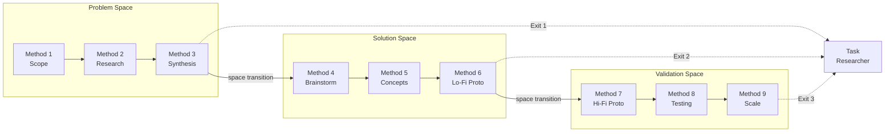

This guide walks through a complete Design Thinking journey, showing how the nine methods work together to transform a vague request into a validated, scalable solution. The walkthrough uses a manufacturing scenario where a plant manager asks to "build a quality dashboard" and the team discovers the real problem is knowledge loss across shifts.

> [!NOTE]
> All prompts in this walkthrough use the **dt-coach** agent. Select it from the agent picker dropdown in Copilot Chat before entering each prompt. See [Using DT Coach](dt-coach.md) for setup details.

## The Complete Journey



## Problem Space: Methods 1-3

The Problem Space ensures your team understands the actual problem before generating solutions. Resist the urge to jump to ideas here.

### Method 1: Scope Conversations

Start by entering the initial request:

```text
We received a request from a plant manager: "Build us a real-time
quality dashboard for the production floor." Help us scope this properly.
```

The coach guides you through frozen-vs-fluid classification, stakeholder mapping, and constraint discovery. By the end of Method 1, you have a validated problem statement that differs from the original request and a stakeholder map that includes hidden stakeholders like union representatives and temporary workers.

### Method 2: Design Research

With the scoped problem in hand, the coach shifts to firsthand evidence gathering:

```text
We've completed scoping. Ready to plan research with operators
and supervisors across day and night shifts.
```

Method 2 produces interview evidence, environmental observations (noise levels, lighting, hand conditions), and a constraint inventory built from direct observation rather than assumptions.

### Method 3: Input Synthesis

Bring research data together into actionable themes:

```text
We have interview transcripts and observation notes from 8
operators, 3 supervisors, and 2 quality engineers. Ready to synthesize.
```

The coach facilitates affinity clustering, theme extraction, and "How Might We" question creation. At this point, the team has validated that the core problem is not missing dashboards but knowledge accessibility, specifically that night-shift operators lack the informal expert network day shifts rely on.

### Transition: Problem Space → Solution Space

When Method 3 outputs are validated across sources and the team has alignment, the coach surfaces the space transition:

```text
/dt-method-next
```

The coach summarizes Problem Space findings, confirms readiness signals, and presents options: move forward to brainstorming, drop back for more research, or hand off to RPI for implementation of the problem statement. Choose to proceed into the Solution Space.

## Solution Space: Methods 4-6

The Solution Space generates and shapes ideas into testable concepts. Constraints discovered in Methods 1-3 anchor creative work.

### Method 4: Brainstorming

Generate diverse solution ideas bounded by validated constraints:

```text
We're ready to brainstorm. Our key constraints are: 85-90 dB
noise, greasy hands preventing touchscreen use, and limited floor space.
```

The coach leads divergent ideation (quantity over quality, no judgment) followed by convergent clustering into solution themes. Four themes emerge: hands-free interaction, visual guidance, collaborative knowledge sharing, and proactive assistance.

### Method 5: User Concepts

Shape solution themes into visual concepts stakeholders can evaluate:

```text
We've clustered our brainstorm into four themes. Ready to
develop these into user concepts for stakeholder feedback.
```

The coach guides concept articulation using desirability, feasibility, and viability analysis. Each concept becomes a 30-second comprehensible visual. Stakeholder feedback narrows focus to a voice-guided repair system with glove-friendly fallback controls.

### Method 6: Low-Fidelity Prototypes

Test concepts with real users in real environments using scrappy prototypes:

```text
The voice-guided repair concept scored highest. Ready to
build lo-fi prototypes and test on the factory floor.
```

Lo-fi prototyping reveals constraints invisible from a desk: touchscreen contamination, QR code lighting failures, and production-timing conflicts. These discoveries refine the concept before any significant engineering investment.

### Transition: Solution Space → Validation Space

When lo-fi prototypes have been tested with real users and core assumptions are validated, the coach surfaces the next transition:

```text
/dt-method-next
```

The coach reviews prototype findings, confirms that concepts have been narrowed to one or two directions, and presents options: proceed to hi-fi prototyping, return to brainstorming with new constraints, or hand off to RPI. Choose to continue into the Validation Space.

## Validation Space: Methods 7-9

The Validation Space builds functional prototypes, tests them systematically, and scales validated solutions.

### Method 7: High-Fidelity Prototypes

Build functional systems with real data for systematic comparison:

```text
Ready to build hi-fi prototypes. We're comparing three
microphone options for voice interaction in 85-90 dB environments.
```

The coach guides technical translation from lo-fi findings into functional specifications. Hi-fi prototypes compare industrial-grade array, bone-conduction headset, and directional lapel mic options with glove-friendly interface variants.

### Method 8: User Testing

Validate prototypes with real users in real environments:

```text
Hi-fi prototypes are built. Ready to plan structured user
testing across four operator types and both shifts.
```

Testing reveals that glove-friendly design drives 40% higher adoption, shift-change periods generate five times normal query volume, and emergency stop procedures are the highest-value use case (300% above forecast).

### Method 9: Iteration at Scale

Optimize the deployed solution using telemetry and usage patterns:

```text
Testing is complete. Ready to plan rollout and define
iteration priorities based on our telemetry data.
```

The coach guides scaling patterns, change management planning, and telemetry-driven optimization. Handoff documentation packages the validated solution with metrics showing new hires use the system three times more frequently than experienced operators.

## DT → RPI Handoff

Design Thinking produces validated understanding; RPI delivers implementation. The handoff can occur at three exit points, each seeding Task Researcher with progressively richer context. Every exit enters the full RPI pipeline at Task Researcher.

| Exit Point                 | Methods | Artifacts Seeded to Researcher                                                                       | Researcher Scope                                                   |
|----------------------------|---------|------------------------------------------------------------------------------------------------------|--------------------------------------------------------------------|
| Problem Statement Complete | 1-3     | Problem statement, stakeholder map, research themes, affinity clusters, constraints, assumptions log | Broad: solution approaches, technology options, feasibility        |
| Concept Validated          | 4-6     | Exit 1 plus tested concepts with D/F/V scores, lo-fi prototype feedback, constraint discoveries      | Moderate: concept feasibility, integration paths, risk areas       |
| Implementation Spec Ready  | 7-9     | Exits 1-2 plus hi-fi specs, architecture decisions, benchmarks, test protocols, scaling plan         | Narrow: implementation refinement, deployment strategy, edge cases |

**Exit 1 assets — Problem Space (Methods 1-3):**

* Stakeholder map with roles, perspectives, and influence levels
* Scope boundaries with frozen/fluid classification
* Interview notes and environmental observation data
* Affinity clusters and insight statements from synthesis
* Validated problem statement reframed from the original request
* How-might-we questions derived from synthesis themes
* Constraint inventory (technical, environmental, workflow)
* Assumptions log with each item tagged `validated`, `assumed`, `unknown`, or `conflicting`

**Exit 2 assets — Solution Space (Methods 4-6),** cumulative with Exit 1:

* Brainstorming theme clusters with selected directions
* `concepts.yml` with desirability/feasibility/viability evaluations per concept
* Lo-fi prototype test observations with behavioral evidence
* Constraint discoveries categorized by type (physical, environmental, workflow) and severity (blocker, friction, minor)
* Validated and invalidated assumptions from user testing
* User behavior patterns observed during prototype interactions
* 1-2 narrowed concept directions advanced from initial ideation

**Exit 3 assets — Validation Space (Methods 7-9),** cumulative with Exits 1-2:

* Architecture decisions and technical trade-offs
* Implementation comparison results across 2-3 approaches
* Fidelity mapping matrix and performance benchmarks
* Integration validation results and specification drafts
* Test protocols with participant profiles and behavioral data (tier 2+)
* Severity-frequency matrix and assumption validation results (tier 2+)
* Refinement log, scaling assessment, and deployment plan (tier 3)
* Adoption metrics with leading and lagging indicators (tier 3)

Each exit point generates two files in `.copilot-tracking/dt/{project-slug}/`: a handoff summary with structured metadata and confidence markers for every artifact, and a self-contained RPI document that Task Researcher consumes directly with all evidence inlined. Earlier exit points transfer leaner artifacts, requiring the Researcher to cast a wider investigation net. Later exit points carry cumulative evidence, narrowing the Researcher's scope to specific verification and refinement targets.

For a step-by-step walkthrough of each handoff, see [Tutorial: Handing Off from DT to RPI](tutorial-handoff-to-rpi.md). For the handoff contract and per-agent mappings, see [DT-RPI Integration](dt-rpi-integration.md).

## Non-Linear Iteration

Methods do not always flow in a straight line. The DT Coach supports backtracking when new evidence warrants it:

* Prototype reveals unknown constraint: Return to Method 2 for targeted research, then re-synthesize in Method 3
* User testing contradicts a theme: Return to Method 3 or Method 2 to investigate
* Brainstorming produces no viable ideas: Return to Method 3 to check theme breadth
* Concept alignment fails: Return to Method 1 to re-engage stakeholders

Each loop produces deeper understanding. The coach tracks iteration history in the coaching state so no context is lost when revisiting earlier methods.

```text
Testing revealed that operators use emergency procedures far
more than routine features. We need to revisit our Method 3 themes to
reframe around safety-critical use cases.
```

The coach re-enters Method 3 with the new evidence, updates synthesis themes, and carries forward everything learned from later methods.

> [!TIP]
> Iteration is progress, not failure. Discovering that your assumptions were wrong in Method 8 is far cheaper than discovering it after full deployment.

Brought to you by microsoft/hve-core

---

<!-- markdownlint-disable MD036 -->
*🤖 Crafted with precision by ✨Copilot following brilliant human instruction,
then carefully refined by our team of discerning human reviewers.*
<!-- markdownlint-enable MD036 -->
