## Overview

The HVE Guide combines two complementary perspectives on AI-assisted engineering: the project lifecycle that defines *what* happens at each stage of delivery, and the role guides that define *how* each team member participates. Together, they provide a complete map of HVE Core tooling organized by both workflow stage and team responsibility.

## Sections

### AI-Assisted Project Lifecycle

A 9-stage lifecycle from initial setup through ongoing operations, with AI-assisted tooling at each stage. Every stage maps to specific agents, prompts, instructions, and skills that accelerate your work.

```mermaid
flowchart LR
    S1["1 · Setup"] --> S2["2 · Discovery"]
    S2 --> S3["3 · Product Definition"]
    S3 --> S4["4 · Decomposition"]
    S4 --> S5["5 · Sprint Planning"]
    S5 --> S6["6 · Implementation"]
    S6 --> S7["7 · Review"]
    S7 --> S8["8 · Delivery"]
    S8 --> S9["9 · Operations"]
    S7 -.->|"rework"| S6
    S8 -.->|"next sprint"| S6
    S9 -.->|"hotfix"| S6
    S9 -.->|"next iteration"| S2
```

> [!TIP]
> [Design Thinking](../design-thinking/using-together.md) can feed into this lifecycle at three exit points. See the [DT-RPI integration guide](../design-thinking/dt-rpi-integration.md) for details.

| Stage   | Name               | Key Tools                                                                                                   |
|---------|--------------------|-------------------------------------------------------------------------------------------------------------|
| Stage 1 | Setup              | hve-core-installer                                                                                          |
| Stage 2 | Discovery          | task-researcher, brd-builder, security-plan-creator, dt-coach                                               |
| Stage 3 | Product Definition | prd-builder, product-manager-advisor, adr-creation, arch-diagram-builder                                    |
| Stage 4 | Decomposition      | ado-prd-to-wit, github-backlog-manager                                                                      |
| Stage 5 | Sprint Planning    | github-backlog-manager, agile-coach                                                                         |
| Stage 6 | Implementation     | task-researcher, task-planner, task-implementor, task-reviewer, rpi-agent, prompt-builder, coding-standards |
| Stage 7 | Review             | task-reviewer, pr-review                                                                                    |
| Stage 8 | Delivery           | pull-request, git-commit, git-merge, ado-get-build-info                                                     |
| Stage 9 | Operations         | doc-ops, doc-ops-update, incident-response                                                                  |

> **Cross-cutting**: memory is available at every stage and is not tied to any single phase.

**[AI-Assisted Project Lifecycle Overview →](lifecycle/)**

### Role Guides

Nine role-specific guides covering recommended collections, stage walkthroughs, starter prompts, and collaboration patterns tailored to how you work.

| Role                     | Primary Stages                              | Guide                                                         |
|--------------------------|---------------------------------------------|---------------------------------------------------------------|
| Engineer                 | Stage 2, Stage 3, Stage 6, Stage 7, Stage 8 | [Engineer](roles/engineer.md)                                 |
| TPM                      | Stage 2, Stage 3, Stage 4, Stage 5, Stage 8 | [TPM](roles/tpm.md)                                           |
| Tech Lead / Architect    | Stage 2, Stage 3, Stage 6, Stage 7, Stage 9 | [Tech Lead](roles/tech-lead.md)                               |
| Security Architect       | Stage 2, Stage 3, Stage 7, Stage 9          | [Security Architect](roles/security-architect.md)             |
| Data Scientist           | Stage 2, Stage 3, Stage 6, Stage 7, Stage 8 | [Data Scientist](roles/data-scientist.md)                     |
| SRE / Operations         | Stage 1, Stage 3, Stage 6, Stage 8, Stage 9 | [SRE / Operations](roles/sre-operations.md)                   |
| Business Program Manager | Stage 2, Stage 3, Stage 4, Stage 5          | [Business Program Manager](roles/business-program-manager.md) |
| New Contributor          | Stage 1, Stage 2, Stage 6, Stage 7          | [New Contributor](roles/new-contributor.md)                   |
| UX Designer              | Stage 2, Stage 3, Stage 6, Stage 7          | [UX Designer](roles/ux-designer.md)                           |
| Utility                  | All                                         | [Utility](roles/utility.md)                                   |

**[Browse All Role Guides →](roles/)**

## Where to Start

| I want to...                            | Go Here                                            |
|-----------------------------------------|----------------------------------------------------|
| Understand the full project workflow    | [Lifecycle Overview](lifecycle/)                   |
| Find tools for my current project phase | [Stage Navigator](lifecycle/#where-are-you)        |
| Get my role-specific guide              | [Role Finder](roles/#find-your-role)               |
| Install collections for my role         | [Collection Quick Reference](roles/#role-overview) |

<!-- markdownlint-disable MD036 -->
*🤖 Crafted with precision by ✨Copilot following brilliant human instruction,
then carefully refined by our team of discerning human reviewers.*
<!-- markdownlint-enable MD036 -->
