## Overview

HVE Core supports a 9-stage project lifecycle, from initial setup through ongoing operations, with AI-assisted tooling at each stage. Every stage maps to specific agents, prompts, instructions, and skills that accelerate your work and reduce friction. Use this guide to navigate the full lifecycle and find the right tools for your current project phase.

## Stage Overview

| Stage   | Name               | Asset Count | Key Tools                                                                                 | Guide                                       |
|---------|--------------------|-------------|-------------------------------------------------------------------------------------------|---------------------------------------------|
| Stage 1 | Setup              | 4           | hve-core-installer, memory                                                                | [Setup](setup.md)                           |
| Stage 2 | Discovery          | 14          | task-researcher, brd-builder, security-plan-creator                                       | [Discovery](discovery.md)                   |
| Stage 3 | Product Definition | 6           | prd-builder, product-manager-advisor, adr-creation                                        | [Product Definition](product-definition.md) |
| Stage 4 | Decomposition      | 5           | ado-prd-to-wit, github-backlog-manager                                                    | [Decomposition](decomposition.md)           |
| Stage 5 | Sprint Planning    | 9           | github-backlog-manager, agile-coach                                                       | [Sprint Planning](sprint-planning.md)       |
| Stage 6 | Implementation     | 30          | task-researcher, task-planner, task-implementor, task-reviewer, rpi-agent, prompt-builder | [Implementation](implementation.md)         |
| Stage 7 | Review             | 11          | task-reviewer, pr-review                                                                  | [Review](review.md)                         |
| Stage 8 | Delivery           | 9           | git-merge, ado-get-build-info                                                             | [Delivery](delivery.md)                     |
| Stage 9 | Operations         | 11          | doc-ops, prompt-builder, incident-response                                                | [Operations](operations.md)                 |

## Where Are You?

Use this navigator to jump directly to the stage matching your current need.

| I want to...                                   | Start Here                                           |
|------------------------------------------------|------------------------------------------------------|
| Set up HVE Core for the first time             | [Stage 1: Setup](setup.md)                           |
| Understand requirements or research a topic    | [Stage 2: Discovery](discovery.md)                   |
| Create a product spec or architecture decision | [Stage 3: Product Definition](product-definition.md) |
| Break work into tasks or work items            | [Stage 4: Decomposition](decomposition.md)           |
| Plan a sprint or manage my backlog             | [Stage 5: Sprint Planning](sprint-planning.md)       |
| Write code, build features, or create content  | [Stage 6: Implementation](implementation.md)         |
| Review code or get PR feedback                 | [Stage 7: Review](review.md)                         |
| Merge, release, or deploy                      | [Stage 8: Delivery](delivery.md)                     |
| Monitor, maintain, or respond to incidents     | [Stage 9: Operations](operations.md)                 |

## Lifecycle Flow

```mermaid
flowchart LR
    Stage1[Stage 1: Setup] -->|environment ready| Stage2[Stage 2: Discovery]
    Stage2 -->|BRD approved| Stage3[Stage 3: Product Definition]
    Stage2 -->|TPMs skip PRD| Stage4[Stage 4: Decomposition]
    Stage3 -->|PRD finalized| Stage4
    Stage4 -->|work items created| Stage5[Stage 5: Sprint Planning]
    Stage5 -->|sprint planned| Stage6[Stage 6: Implementation]
    Stage6 -->|PR submitted| Stage7[Stage 7: Review]
    Stage7 -->|approved| Stage8[Stage 8: Delivery]
    Stage7 -->|rework needed| Stage6
    Stage8 -->|next sprint| Stage6
    Stage8 -->|final sprint complete| Stage9[Stage 9: Operations]
    Stage9 -->|hotfix needed| Stage6
```

## Stage Transition Rules

1. Stage 1 to Stage 2: Installation complete
2. Stage 2 to Stage 3: BRD complete, handoff at `docs/brds/`
3. Stage 2 to Stage 4: TPMs skip PRD when BRD is sufficient
4. Stage 3 to Stage 4: PRD and ADRs finalized
5. Stage 4 to Stage 5: Work items created
6. Stage 5 to Stage 6: Sprint planned
7. Stage 6 to Stage 7: Implementation complete, `/clear` context
8. Stage 7 to Stage 8: PR approved
9. Stage 7 to Stage 6: Rework needed
10. Stage 8 to Stage 6: Next sprint
11. Stage 8 to Stage 9: Final sprint complete
12. Stage 9 to Stage 6: Hotfix needed

## Coverage Notes

Stage 6 Implementation carries the highest asset density with 30 assets, representing roughly 35% of all stage assignments. Stage 8 Delivery has zero agents and operates entirely through prompts and auto-activated instructions. Stage 1 Setup has minimal coverage with only 4 assets, reflecting its narrow scope as a one-time onboarding step.

Each stage page follows a consistent structure covering purpose, key activities, AI-assisted workflow, and cross-references. This format lets you navigate directly to the stage relevant to your current work and find both manual checklists and AI agent commands. Stages with fewer tools (Stage 1 through Stage 5) use flat tables, while stages with more tools (Stage 6 through Stage 9) use categorized subsections for navigability.

## Next Steps

> [!TIP]
> Find your role-specific guide at [Role Guides](../roles/) to see which stages matter most for your work.

<!-- markdownlint-disable MD036 -->
*🤖 Crafted with precision by ✨Copilot following brilliant human instruction,
then carefully refined by our team of discerning human reviewers.*
<!-- markdownlint-enable MD036 -->
