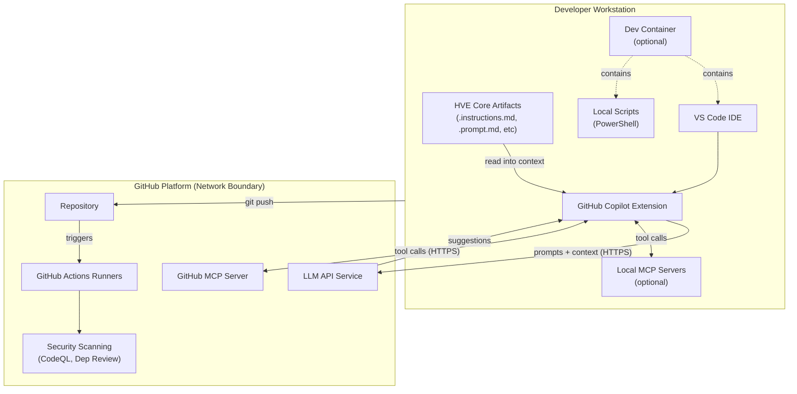

## Executive Summary

HVE Core is an enterprise prompt engineering framework for GitHub Copilot consisting of:

- Markdown-based prompt artifacts (instructions, prompts, agents, skills)
- PowerShell automation scripts for linting and validation
- GitHub Actions CI/CD workflows
- VS Code extension packaging utilities

The repository contains no runtime services, databases, or user data storage. Primary threats target supply chain integrity and developer workflow compromise. Security relies on defense-in-depth with 18+ automated controls validated through CI/CD pipelines.

### Security Posture Overview

| Category                 | Status  | Control Count | Automated |
|--------------------------|---------|---------------|-----------|
| Supply Chain Security    | Strong  | 6 controls    | 100%      |
| Code Quality             | Strong  | 5 controls    | 100%      |
| Access Control           | Strong  | 4 controls    | 100%      |
| Vulnerability Management | Strong  | 3 controls    | 100%      |
| Total                    | **18+** | **18**        | **100%**  |

## Contents

- [System Description](#system-description)
- [Trust Boundaries](#trust-boundaries)
- [Threat Model](#threat-model)
  - [STRIDE Threats](#stride-threats)
  - [Dev Container Threats](#dev-container-threats)
  - [AI-Specific Threats](#ai-specific-threats)
  - [Responsible AI Threats](#responsible-ai-threats)
- [Security Controls](#security-controls)
- [Assurance Argument](#assurance-argument)
- [MCP Server Trust Analysis](#mcp-server-trust-analysis)
- [Quantitative Security Metrics](#quantitative-security-metrics)
- [References](#references)

## System Description

### Components

HVE Core contains four primary component categories:

1. **Prompt Engineering Artifacts** (`.github/instructions/`, `.github/prompts/`, `.github/agents/`, `.github/skills/`)
   - Markdown files with YAML frontmatter
   - Consumed by GitHub Copilot during development sessions
   - No executable code execution within prompts

2. **PowerShell Scripts** (`scripts/`)
   - Linting and validation utilities
   - CI/CD automation support
   - No external network connections except documented tool downloads

3. **GitHub Actions Workflows** (`.github/workflows/`)
   - PR validation pipeline
   - Security scanning (CodeQL, dependency review)
   - Release automation

4. **VS Code Extension** (`extension/`)
   - Packaging configuration
   - Extension manifest
   - No telemetry or data collection

### Data Flow



### Security Inheritance from GitHub Copilot

HVE Core artifacts are consumed by GitHub Copilot, which provides foundational security:

| Inherited Control               | Provider       | HVE Core Responsibility                 |
|---------------------------------|----------------|-----------------------------------------|
| LLM input/output filtering      | GitHub Copilot | None; artifacts are Copilot inputs      |
| Token encryption in transit     | GitHub Copilot | None; handled by Copilot infrastructure |
| Organization policy enforcement | GitHub Copilot | Document compatible policy options      |
| Audit logging                   | GitHub Copilot | None; uses Copilot audit streams        |
| SOC 2 Type II compliance        | GitHub         | None; infrastructure control            |

## Trust Boundaries

### Boundary Diagram

```text
┌──────────────────────────────────────────────────────────────────────────────┐
│                    TRUST BOUNDARY: Repository Contents                       │
│  ┌────────────────────────────────────────────────────────────────────────┐  │
│  │                         Controlled Artifacts                           │  │
│  │  ┌────────────┐  ┌────────────┐  ┌────────────┐  ┌────────────────┐   │  │
│  │  │ Prompts    │  │ Scripts    │  │ Workflows  │  │ Documentation  │   │  │
│  │  │ .md files  │  │ .ps1 files │  │ .yml files │  │ .md files      │   │  │
│  │  └────────────┘  └────────────┘  └────────────┘  └────────────────┘   │  │
│  └────────────────────────────────────────────────────────────────────────┘  │
│                                      │                                       │
│  ┌───────────────────────────────────▼────────────────────────────────────┐  │
│  │                   TRUST BOUNDARY: CI/CD Pipeline                       │  │
│  │  ┌────────────┐  ┌────────────┐  ┌────────────┐  ┌────────────────┐   │  │
│  │  │ PR Valid.  │  │ CodeQL     │  │ Dep Review │  │ Release        │   │  │
│  │  │ Workflow   │  │ Analysis   │  │ Workflow   │  │ Workflow       │   │  │
│  │  └────────────┘  └────────────┘  └────────────┘  └────────────────┘   │  │
│  └────────────────────────────────────────────────────────────────────────┘  │
└──────────────────────────────────────────────────────────────────────────────┘
                                       │
     ┌─────────────────────────────────┼──────────────────────────────────┐
     │                                 ▼                                  │
     │            TRUST BOUNDARY: External Dependencies                   │
     │  ┌────────────┐  ┌────────────┐  ┌────────────┐  ┌──────────────┐ │
     │  │ npm        │  │ GitHub     │  │ PowerShell │  │ Third-party  │ │
     │  │ Packages   │  │ Actions    │  │ Gallery    │  │ MCP Servers  │ │
     │  └────────────┘  └────────────┘  └────────────┘  └──────────────┘ │
     └────────────────────────────────────────────────────────────────────┘
```

### Boundary Descriptions

| Boundary              | Assets Protected                       | Controls Enforced                         |
|-----------------------|----------------------------------------|-------------------------------------------|
| Repository Contents   | Source code, prompts, scripts          | CODEOWNERS, branch protection, PR review  |
| CI/CD Pipeline        | Build artifacts, security scan results | Minimal permissions, SHA pinning          |
| External Dependencies | npm packages, Actions, MCP servers     | Dependency review, staleness monitoring   |
| Dev Container         | Development environment, tooling       | SHA256 verification, first-party features |

## Threat Model

This section documents threats using [STRIDE](https://learn.microsoft.com/azure/security/develop/threat-modeling-tool-threats) methodology (Spoofing, Tampering, Repudiation, Information Disclosure, Denial of Service, Elevation of Privilege), supplemented with AI-specific and Responsible AI threat categories.

### STRIDE Threats

#### S-1: Compromised GitHub Action via Tag Substitution

| Field             | Value                                                                                |
|-------------------|--------------------------------------------------------------------------------------|
| **Category**      | Spoofing                                                                             |
| **Asset**         | CI/CD pipeline integrity                                                             |
| **Threat**        | Attacker compromises upstream Action repository and replaces tag with malicious code |
| **Likelihood**    | Medium (documented supply chain attacks exist)                                       |
| **Impact**        | High (full CI/CD compromise, secret exfiltration)                                    |
| **Mitigations**   | SHA pinning for all Actions, staleness monitoring, CodeQL scanning                   |
| **Residual Risk** | Low (SHA immutable; requires GitHub infrastructure compromise)                       |
| **Status**        | Mitigated                                                                            |

#### S-2: npm Package Substitution Attack

| Field             | Value                                                       |
|-------------------|-------------------------------------------------------------|
| **Category**      | Spoofing                                                    |
| **Asset**         | Build dependencies                                          |
| **Threat**        | Malicious package published with same name or typosquatting |
| **Likelihood**    | Medium (common attack vector)                               |
| **Impact**        | Medium (limited runtime exposure; primarily build-time)     |
| **Mitigations**   | Package-lock.json integrity, npm audit, dependency review   |
| **Residual Risk** | Low                                                         |
| **Status**        | Mitigated                                                   |

#### T-1: Unauthorized Modification of Security Controls

| Field             | Value                                                             |
|-------------------|-------------------------------------------------------------------|
| **Category**      | Tampering                                                         |
| **Asset**         | Workflow files, security scripts                                  |
| **Threat**        | Attacker with write access disables security checks               |
| **Likelihood**    | Low (requires compromised maintainer account)                     |
| **Impact**        | High (security controls bypassed)                                 |
| **Mitigations**   | CODEOWNERS enforcement, branch protection, PR review requirements |
| **Residual Risk** | Low                                                               |
| **Status**        | Mitigated                                                         |

#### T-2: Malicious Prompt Injection via PR

| Field             | Value                                                         |
|-------------------|---------------------------------------------------------------|
| **Category**      | Tampering                                                     |
| **Asset**         | Prompt artifacts                                              |
| **Threat**        | Contributor submits prompt with hidden malicious instructions |
| **Likelihood**    | Medium (social engineering possible)                          |
| **Impact**        | Medium (affects Copilot behavior for consumers)               |
| **Mitigations**   | PR review, CODEOWNERS, frontmatter validation                 |
| **Residual Risk** | Medium (semantic analysis not automated)                      |
| **Status**        | Partially Mitigated                                           |

#### R-1: Untraceable Configuration Changes

| Field             | Value                                                      |
|-------------------|------------------------------------------------------------|
| **Category**      | Repudiation                                                |
| **Asset**         | Repository configuration                                   |
| **Threat**        | Admin makes security-impacting changes without audit trail |
| **Likelihood**    | Low (GitHub provides audit logs)                           |
| **Impact**        | Medium (accountability gap)                                |
| **Mitigations**   | GitHub audit log, branch protection audit events           |
| **Residual Risk** | Low                                                        |
| **Status**        | Mitigated                                                  |

#### I-1: Secret Exposure in Logs or Artifacts

| Field             | Value                                                               |
|-------------------|---------------------------------------------------------------------|
| **Category**      | Information Disclosure                                              |
| **Asset**         | Repository secrets, tokens                                          |
| **Threat**        | Secrets accidentally logged or included in build artifacts          |
| **Likelihood**    | Low (minimal secret usage)                                          |
| **Impact**        | High (credential compromise)                                        |
| **Mitigations**   | GitHub secret masking, GitHub secret scanning, minimal secret usage |
| **Residual Risk** | Low                                                                 |
| **Status**        | Mitigated                                                           |

#### I-2: Sensitive Information in Prompt Artifacts

| Field             | Value                                                               |
|-------------------|---------------------------------------------------------------------|
| **Category**      | Information Disclosure                                              |
| **Asset**         | Prompt files, documentation                                         |
| **Threat**        | Internal URLs, API keys, or proprietary patterns exposed in prompts |
| **Likelihood**    | Low (review process catches obvious cases)                          |
| **Impact**        | Medium (information leakage)                                        |
| **Mitigations**   | PR review, GitHub secret scanning, documentation guidelines         |
| **Residual Risk** | Low                                                                 |
| **Status**        | Mitigated                                                           |

#### D-1: CI/CD Resource Exhaustion

| Field             | Value                                                             |
|-------------------|-------------------------------------------------------------------|
| **Category**      | Denial of Service                                                 |
| **Asset**         | GitHub Actions minutes, runner availability                       |
| **Threat**        | Malicious PR triggers expensive workflows repeatedly              |
| **Likelihood**    | Low (requires PR creation privileges)                             |
| **Impact**        | Low (billing impact, temporary delays)                            |
| **Mitigations**   | Workflow approval for first-time contributors, concurrency limits |
| **Residual Risk** | Low                                                               |
| **Status**        | Mitigated                                                         |

#### D-2: Dependency Confusion Blocking Builds

| Field             | Value                                                          |
|-------------------|----------------------------------------------------------------|
| **Category**      | Denial of Service                                              |
| **Asset**         | Build pipeline                                                 |
| **Threat**        | Attacker publishes conflicting package preventing clean builds |
| **Likelihood**    | Low                                                            |
| **Impact**        | Medium (build failures)                                        |
| **Mitigations**   | Package-lock.json, scoped packages                             |
| **Residual Risk** | Low                                                            |
| **Status**        | Mitigated                                                      |

#### E-1: Workflow Token Abuse

| Field             | Value                                                             |
|-------------------|-------------------------------------------------------------------|
| **Category**      | Elevation of Privilege                                            |
| **Asset**         | GitHub Actions tokens                                             |
| **Threat**        | Compromised workflow step uses GITHUB_TOKEN beyond intended scope |
| **Likelihood**    | Low (minimal permissions declared)                                |
| **Impact**        | Medium (depends on token permissions)                             |
| **Mitigations**   | Minimal permissions pattern, persist-credentials: false           |
| **Residual Risk** | Low                                                               |
| **Status**        | Mitigated                                                         |

#### E-2: Branch Protection Bypass

| Field             | Value                                                            |
|-------------------|------------------------------------------------------------------|
| **Category**      | Elevation of Privilege                                           |
| **Asset**         | Protected branches                                               |
| **Threat**        | Admin bypasses branch protection to merge unauthorized changes   |
| **Likelihood**    | Low (requires admin access and intentional bypass)               |
| **Impact**        | High (security controls circumvented)                            |
| **Mitigations**   | Branch protection rules, audit logging, "Do not allow bypassing" |
| **Residual Risk** | Low                                                              |
| **Status**        | Mitigated                                                        |

### Dev Container Threats

These threats address risks in the development container configuration used for Codespaces and local container development.

#### DC-1: Feature Tag Substitution Attack

| Field             | Value                                                                    |
|-------------------|--------------------------------------------------------------------------|
| **Category**      | Spoofing                                                                 |
| **Asset**         | Dev container configuration                                              |
| **Threat**        | Malicious update to a feature version tag introduces compromised tooling |
| **Likelihood**    | Low (first-party Microsoft features only)                                |
| **Impact**        | Medium (development environment compromise)                              |
| **Mitigations**   | First-party features only, PR review of devcontainer.json changes        |
| **Residual Risk** | Low (Microsoft-maintained features with release controls)                |
| **Status**        | Mitigated                                                                |

#### DC-2: Lifecycle Script Tampering

| Field             | Value                                                           |
|-------------------|-----------------------------------------------------------------|
| **Category**      | Tampering                                                       |
| **Asset**         | Container initialization scripts                                |
| **Threat**        | Attacker modifies on-create.sh or post-create.sh to inject code |
| **Likelihood**    | Low (requires PR approval, CODEOWNERS protection)               |
| **Impact**        | High (arbitrary code execution in dev environment)              |
| **Mitigations**   | CODEOWNERS, PR review, branch protection                        |
| **Residual Risk** | Low                                                             |
| **Status**        | Mitigated                                                       |

#### DC-3: External Binary Download Compromise

| Field             | Value                                                       |
|-------------------|-------------------------------------------------------------|
| **Category**      | Spoofing                                                    |
| **Asset**         | External tools (gitleaks, shellcheck)                       |
| **Threat**        | Compromised download source serves malicious binary         |
| **Likelihood**    | Very Low (SHA256 verification enforced)                     |
| **Impact**        | High (malicious tooling in dev environment)                 |
| **Mitigations**   | SHA256 checksum verification in on-create.sh                |
| **Residual Risk** | Very Low (cryptographic verification prevents substitution) |
| **Status**        | Mitigated                                                   |

### AI-Specific Threats

These threats address risks specific to AI/ML systems as documented by [OWASP LLM Top 10](https://owasp.org/www-project-top-10-for-large-language-model-applications/) and [MITRE ATLAS](https://atlas.mitre.org/).

#### AI-1: Prompt Injection via Artifact Content

| Field             | Value                                                                  |
|-------------------|------------------------------------------------------------------------|
| **Category**      | LLM01: Prompt Injection (OWASP)                                        |
| **Asset**         | Copilot behavior, downstream code generation                           |
| **Threat**        | Malicious instructions embedded in prompt artifacts manipulate Copilot |
| **Likelihood**    | Medium                                                                 |
| **Impact**        | Medium (affects code generation quality and safety)                    |
| **Mitigations**   | PR review, CODEOWNERS, clear artifact structure guidelines             |
| **Residual Risk** | Medium (inherent to prompt-based systems)                              |
| **Status**        | Partially Mitigated                                                    |

#### AI-2: Insecure Output Handling

| Field             | Value                                                             |
|-------------------|-------------------------------------------------------------------|
| **Category**      | LLM02: Insecure Output Handling (OWASP)                           |
| **Asset**         | Generated code                                                    |
| **Threat**        | Copilot generates insecure code patterns based on prompt guidance |
| **Likelihood**    | Medium                                                            |
| **Impact**        | Variable (depends on consumer's review practices)                 |
| **Mitigations**   | Security-focused prompts, consumer code review responsibility     |
| **Residual Risk** | Medium (HVE Core provides guidance, not enforcement)              |
| **Status**        | Accepted with Documentation                                       |

#### AI-3: Training Data Poisoning (Indirect)

| Field             | Value                                                     |
|-------------------|-----------------------------------------------------------|
| **Category**      | LLM03: Training Data Poisoning (OWASP)                    |
| **Asset**         | Copilot model behavior                                    |
| **Threat**        | Malicious patterns in HVE Core influence Copilot training |
| **Likelihood**    | Very Low (Copilot training controlled by GitHub)          |
| **Impact**        | Low (HVE Core is small input to large training corpus)    |
| **Mitigations**   | Out of scope; GitHub controls training pipeline           |
| **Residual Risk** | Very Low                                                  |
| **Status**        | Accepted (Outside Control)                                |

#### AI-4: Model Denial of Service

| Field             | Value                                                           |
|-------------------|-----------------------------------------------------------------|
| **Category**      | LLM04: Model Denial of Service (OWASP)                          |
| **Asset**         | Copilot availability                                            |
| **Threat**        | Crafted prompts cause excessive resource consumption in Copilot |
| **Likelihood**    | Very Low                                                        |
| **Impact**        | Low (Copilot has rate limiting)                                 |
| **Mitigations**   | Copilot's built-in rate limiting and resource management        |
| **Residual Risk** | Very Low                                                        |
| **Status**        | Accepted (Outside Control)                                      |

#### AI-5: Supply Chain Vulnerabilities (LLM-Specific)

| Field             | Value                                                        |
|-------------------|--------------------------------------------------------------|
| **Category**      | LLM05: Supply-Chain Vulnerabilities (OWASP)                  |
| **Asset**         | MCP server integrations                                      |
| **Threat**        | Compromised MCP server provides malicious context to Copilot |
| **Likelihood**    | Low (first-party servers) to Medium (third-party)            |
| **Impact**        | Medium (affects code generation context)                     |
| **Mitigations**   | MCP server trust analysis, documentation of trust levels     |
| **Residual Risk** | Low to Medium depending on server                            |
| **Status**        | Mitigated with Documentation                                 |

#### AI-6: Sensitive Information Disclosure

| Field             | Value                                                                |
|-------------------|----------------------------------------------------------------------|
| **Category**      | LLM06: Sensitive Information Disclosure (OWASP)                      |
| **Asset**         | User context, code patterns                                          |
| **Threat**        | Prompt artifacts cause Copilot to expose sensitive patterns          |
| **Likelihood**    | Low                                                                  |
| **Impact**        | Medium                                                               |
| **Mitigations**   | Consumer responsibility; prompt guidelines discourage sensitive data |
| **Residual Risk** | Low                                                                  |
| **Status**        | Mitigated with Documentation                                         |

#### AI-7: Insecure Plugin Design

| Field             | Value                                                           |
|-------------------|-----------------------------------------------------------------|
| **Category**      | LLM07: Insecure Plugin Design (OWASP)                           |
| **Asset**         | MCP server integrations, VS Code extension                      |
| **Threat**        | Extension or MCP server allows unauthorized operations          |
| **Likelihood**    | Low (extension has no sensitive operations)                     |
| **Impact**        | Low to Medium                                                   |
| **Mitigations**   | Minimal extension functionality, MCP server trust documentation |
| **Residual Risk** | Low                                                             |
| **Status**        | Mitigated                                                       |

#### AI-8: Excessive Agency

| Field             | Value                                                    |
|-------------------|----------------------------------------------------------|
| **Category**      | LLM08: Excessive Agency (OWASP)                          |
| **Asset**         | Autonomous Copilot operations                            |
| **Threat**        | Prompts grant Copilot excessive autonomous capabilities  |
| **Likelihood**    | Low (prompts are guidance, not permissions)              |
| **Impact**        | Variable                                                 |
| **Mitigations**   | Copilot's built-in guardrails, tool confirmation dialogs |
| **Residual Risk** | Low                                                      |
| **Status**        | Mitigated (Copilot Controls)                             |

#### AI-9: Overreliance

| Field             | Value                                                      |
|-------------------|------------------------------------------------------------|
| **Category**      | LLM09: Overreliance (OWASP)                                |
| **Asset**         | Code quality, developer decision-making                    |
| **Threat**        | Developers accept Copilot output without verification      |
| **Likelihood**    | Medium                                                     |
| **Impact**        | Variable (depends on context)                              |
| **Mitigations**   | Documentation emphasizing review, security-focused prompts |
| **Residual Risk** | Medium (behavioral, not technical)                         |
| **Status**        | Accepted with Documentation                                |

#### AI-10: Model Theft (N/A)

| Field             | Value                                       |
|-------------------|---------------------------------------------|
| **Category**      | LLM10: Model Theft (OWASP)                  |
| **Asset**         | N/A                                         |
| **Threat**        | HVE Core does not host or distribute models |
| **Likelihood**    | N/A                                         |
| **Impact**        | N/A                                         |
| **Mitigations**   | N/A                                         |
| **Residual Risk** | N/A                                         |
| **Status**        | Not Applicable                              |

#### AI-11: AML.T0043 Craft Adversarial Data (MITRE ATLAS)

| Field             | Value                                                        |
|-------------------|--------------------------------------------------------------|
| **Category**      | MITRE ATLAS AML.T0043                                        |
| **Asset**         | Prompt artifacts                                             |
| **Threat**        | Adversary crafts prompt content to cause model misbehavior   |
| **Likelihood**    | Medium                                                       |
| **Impact**        | Medium                                                       |
| **Mitigations**   | PR review process, CODEOWNERS, artifact structure validation |
| **Residual Risk** | Medium                                                       |
| **Status**        | Partially Mitigated                                          |

#### AI-12: AML.T0048 Evade ML Model (MITRE ATLAS)

| Field             | Value                                                         |
|-------------------|---------------------------------------------------------------|
| **Category**      | MITRE ATLAS AML.T0048                                         |
| **Asset**         | Security recommendations in prompts                           |
| **Threat**        | Prompts designed to cause Copilot to bypass security guidance |
| **Likelihood**    | Low                                                           |
| **Impact**        | Medium                                                        |
| **Mitigations**   | Security-first prompt design principles, review process       |
| **Residual Risk** | Low                                                           |
| **Status**        | Mitigated                                                     |

### Responsible AI Threats

These threats address ethical and responsible AI considerations aligned with Microsoft's Responsible AI principles.

#### RAI-1: Fairness - Biased Code Generation Patterns

| Field             | Value                                                                      |
|-------------------|----------------------------------------------------------------------------|
| **Category**      | Fairness (Microsoft RAI Standard)                                          |
| **Asset**         | Generated code quality across contexts                                     |
| **Threat**        | Prompts inadvertently favor certain coding styles or exclude accessibility |
| **Likelihood**    | Medium                                                                     |
| **Impact**        | Medium (affects inclusivity of generated code)                             |
| **Mitigations**   | Inclusive language guidelines, accessibility-aware prompts                 |
| **Residual Risk** | Medium                                                                     |
| **Status**        | Partially Mitigated                                                        |

#### RAI-2: Reliability - Inconsistent Prompt Behavior

| Field             | Value                                                       |
|-------------------|-------------------------------------------------------------|
| **Category**      | Reliability & Safety (Microsoft RAI Standard)               |
| **Asset**         | Prompt consistency                                          |
| **Threat**        | Same prompt produces significantly different outputs        |
| **Likelihood**    | Medium (inherent to LLMs)                                   |
| **Impact**        | Low to Medium                                               |
| **Mitigations**   | Structured prompts, explicit instructions, testing guidance |
| **Residual Risk** | Medium (LLM behavior inherently variable)                   |
| **Status**        | Accepted with Documentation                                 |

#### RAI-3: Privacy - Context Leakage via Prompts

| Field             | Value                                                         |
|-------------------|---------------------------------------------------------------|
| **Category**      | Privacy & Security (Microsoft RAI Standard)                   |
| **Asset**         | Developer context, code patterns                              |
| **Threat**        | Prompts cause Copilot to surface or infer private information |
| **Likelihood**    | Low                                                           |
| **Impact**        | Medium                                                        |
| **Mitigations**   | Privacy-conscious prompt design, consumer guidelines          |
| **Residual Risk** | Low                                                           |
| **Status**        | Mitigated with Documentation                                  |

#### RAI-4: Inclusiveness - Exclusionary Language in Artifacts

| Field             | Value                                                    |
|-------------------|----------------------------------------------------------|
| **Category**      | Inclusiveness (Microsoft RAI Standard)                   |
| **Asset**         | Prompt artifacts, documentation                          |
| **Threat**        | Language in prompts excludes or marginalizes user groups |
| **Likelihood**    | Low (writing style guidelines address this)              |
| **Impact**        | Medium (affects adoption and trust)                      |
| **Mitigations**   | Inclusive writing guidelines, spell check, PR review     |
| **Residual Risk** | Low                                                      |
| **Status**        | Mitigated                                                |

#### RAI-5: Transparency - Undocumented Prompt Behavior

| Field             | Value                                                            |
|-------------------|------------------------------------------------------------------|
| **Category**      | Transparency (Microsoft RAI Standard)                            |
| **Asset**         | User understanding of system behavior                            |
| **Threat**        | Prompts cause unexpected Copilot behavior not explained to users |
| **Likelihood**    | Medium                                                           |
| **Impact**        | Low to Medium                                                    |
| **Mitigations**   | Clear documentation, explicit prompt descriptions in frontmatter |
| **Residual Risk** | Low                                                              |
| **Status**        | Mitigated                                                        |

#### RAI-6: Accountability - Unclear Responsibility for Generated Code

| Field             | Value                                                                |
|-------------------|----------------------------------------------------------------------|
| **Category**      | Accountability (Microsoft RAI Standard)                              |
| **Asset**         | Liability and responsibility clarity                                 |
| **Threat**        | Ambiguity about who is responsible for Copilot-generated code issues |
| **Likelihood**    | Medium (common confusion)                                            |
| **Impact**        | Medium                                                               |
| **Mitigations**   | Documentation clarifying HVE Core provides guidance only             |
| **Residual Risk** | Low                                                                  |
| **Status**        | Mitigated with Documentation                                         |

#### RAI-7: Human Oversight - Automated Changes Without Review

| Field             | Value                                                          |
|-------------------|----------------------------------------------------------------|
| **Category**      | Human Oversight (Microsoft RAI Standard)                       |
| **Asset**         | Code quality, security                                         |
| **Threat**        | Prompts encourage accepting Copilot suggestions without review |
| **Likelihood**    | Low (prompts emphasize review)                                 |
| **Impact**        | Variable                                                       |
| **Mitigations**   | Prompts include review reminders, security-conscious patterns  |
| **Residual Risk** | Low                                                            |
| **Status**        | Mitigated                                                      |

#### RAI-8: Value Alignment - Prompts Conflicting with Organizational Values

| Field             | Value                                                         |
|-------------------|---------------------------------------------------------------|
| **Category**      | Value Alignment (Microsoft RAI Standard)                      |
| **Asset**         | Organizational trust                                          |
| **Threat**        | Prompt artifacts conflict with consumer organization's values |
| **Likelihood**    | Low                                                           |
| **Impact**        | Medium (reputational)                                         |
| **Mitigations**   | General-purpose prompts, customization guidance for consumers |
| **Residual Risk** | Low                                                           |
| **Status**        | Mitigated with Documentation                                  |

#### RAI-9: Proportionality - Overly Aggressive Automation

| Field             | Value                                                                    |
|-------------------|--------------------------------------------------------------------------|
| **Category**      | Proportionality (Microsoft RAI Standard)                                 |
| **Asset**         | Developer autonomy                                                       |
| **Threat**        | Prompts push Copilot toward excessive automation reducing human judgment |
| **Likelihood**    | Low                                                                      |
| **Impact**        | Medium                                                                   |
| **Mitigations**   | Human-in-the-loop design patterns in prompts                             |
| **Residual Risk** | Low                                                                      |
| **Status**        | Mitigated                                                                |

#### RAI-10: Contestability - No Mechanism to Challenge AI Decisions

| Field             | Value                                                                    |
|-------------------|--------------------------------------------------------------------------|
| **Category**      | Contestability (Microsoft RAI Standard)                                  |
| **Asset**         | User agency                                                              |
| **Threat**        | Users cannot override or question Copilot behavior influenced by prompts |
| **Likelihood**    | Low (Copilot suggestions are optional)                                   |
| **Impact**        | Low                                                                      |
| **Mitigations**   | Copilot's non-mandatory nature, edit/reject options built-in             |
| **Residual Risk** | Very Low                                                                 |
| **Status**        | Mitigated (Copilot Controls)                                             |

#### RAI-11: Societal Impact - Deskilling Developers

| Field             | Value                                                         |
|-------------------|---------------------------------------------------------------|
| **Category**      | Societal Impact (Microsoft RAI Standard)                      |
| **Asset**         | Developer skill development                                   |
| **Threat**        | Over-reliance on AI-assisted coding reduces skill development |
| **Likelihood**    | Medium (industry-wide concern)                                |
| **Impact**        | Low for HVE Core specifically                                 |
| **Mitigations**   | Prompts emphasize learning and understanding, not just output |
| **Residual Risk** | Medium (societal, not technical)                              |
| **Status**        | Accepted with Documentation                                   |

#### RAI-12: Environmental Impact - Compute Resource Awareness

| Field             | Value                                                   |
|-------------------|---------------------------------------------------------|
| **Category**      | Environmental Impact (Microsoft RAI Standard)           |
| **Asset**         | Compute resources                                       |
| **Threat**        | Inefficient prompts cause unnecessary model computation |
| **Likelihood**    | Low                                                     |
| **Impact**        | Low (marginal compute impact)                           |
| **Mitigations**   | Efficient prompt design guidelines                      |
| **Residual Risk** | Very Low                                                |
| **Status**        | Accepted                                                |

#### RAI-13: Misinformation - Prompts Generating Incorrect Information

| Field             | Value                                                             |
|-------------------|-------------------------------------------------------------------|
| **Category**      | Misinformation (Microsoft RAI Standard)                           |
| **Asset**         | Documentation and code accuracy                                   |
| **Threat**        | Prompts cause Copilot to generate plausible but incorrect content |
| **Likelihood**    | Medium (LLM hallucination is known issue)                         |
| **Impact**        | Medium                                                            |
| **Mitigations**   | Verification prompts, citation requirements in prompt guidelines  |
| **Residual Risk** | Medium (inherent LLM limitation)                                  |
| **Status**        | Partially Mitigated                                               |

## Security Controls

### Supply Chain Security Controls

| ID   | Control                    | Implementation                       | Validates Against |
|------|----------------------------|--------------------------------------|-------------------|
| SC-1 | SHA Pinning Validation     | Test-DependencyPinning.ps1           | S-1, S-2          |
| SC-2 | SHA Staleness Monitoring   | Test-SHAStaleness.ps1                | S-1               |
| SC-3 | Dependency Review          | dependency-review.yml                | S-2, AI-5         |
| SC-4 | npm Security Audit         | npm audit in pr-validation.yml       | S-2               |
| SC-5 | Dependabot Updates         | dependabot.yml                       | S-1, S-2          |
| SC-6 | Tool Checksum Verification | scripts/security/tool-checksums.json | S-1               |

### Code Quality Controls

| ID   | Control                | Implementation                   | Validates Against |
|------|------------------------|----------------------------------|-------------------|
| CQ-1 | CodeQL Analysis        | codeql-analysis.yml              | T-1, E-1          |
| CQ-2 | Markdown Linting       | lint:md npm script               | T-2, RAI-4        |
| CQ-3 | Frontmatter Validation | Validate-MarkdownFrontmatter.ps1 | T-2               |
| CQ-4 | PowerShell Analysis    | Invoke-PSScriptAnalyzer.ps1      | T-1               |
| CQ-5 | YAML Linting           | Invoke-YamlLint.ps1              | T-1               |

### Access Controls

| ID   | Control                      | Implementation                | Validates Against |
|------|------------------------------|-------------------------------|-------------------|
| AC-1 | Branch Protection            | Repository settings           | T-1, E-2          |
| AC-2 | CODEOWNERS Enforcement       | .github/CODEOWNERS            | T-1, T-2          |
| AC-3 | PR Review Requirements       | Branch protection rules       | T-2, AI-1         |
| AC-4 | Minimal Workflow Permissions | permissions: in all workflows | E-1               |

### Vulnerability Management Controls

| ID   | Control                         | Implementation                                      | Validates Against |
|------|---------------------------------|-----------------------------------------------------|-------------------|
| VM-1 | Coordinated Disclosure          | SECURITY.md                                         | I-1               |
| VM-2 | Secret Scanning                 | GitHub native, gitleaks PR gate (gitleaks-scan.yml) | I-1, I-2          |
| VM-3 | Credential Persistence Disabled | persist-credentials: false                          | I-1, E-1          |

## Assurance Argument

This section presents the security assurance case using Goal Structuring Notation (GSN) patterns.

### Top-Level Goal

**G0**: HVE Core is acceptably secure for its intended use as an enterprise prompt engineering framework.

### Supporting Goals

| Goal   | Statement                                      | Strategy                               |
|--------|------------------------------------------------|----------------------------------------|
| **G1** | Supply chain attacks are mitigated             | S1: Defense-in-depth controls          |
| **G2** | Unauthorized modifications are prevented       | S2: Access control enforcement         |
| **G3** | AI-specific risks are documented and addressed | S3: Risk acceptance with documentation |
| **G4** | Responsible AI principles are followed         | S4: Guidelines and review processes    |

### Evidence Mapping

| Goal | Evidence                                                            |
|------|---------------------------------------------------------------------|
| G1   | SHA pinning logs, staleness reports, dependency review results      |
| G2   | Branch protection configuration, CODEOWNERS file, PR review history |
| G3   | This threat model document, MCP trust analysis                      |
| G4   | Writing style guidelines, inclusive language checks, PR reviews     |

### Assumptions and Justifications

| ID | Assumption                                 | Justification                         |
|----|--------------------------------------------|---------------------------------------|
| A1 | GitHub platform security is adequate       | SOC 2 Type II certified               |
| A2 | GitHub Copilot provides baseline AI safety | Microsoft RAI compliance              |
| A3 | Contributors act in good faith             | PR review provides verification       |
| A4 | Consumers implement their own code review  | Documented as consumer responsibility |

### Argument Summary

HVE Core achieves acceptable security through:

1. **Automated Controls**: 18+ security controls execute automatically via CI/CD
2. **Defense-in-Depth**: Multiple overlapping controls for critical threats
3. **Transparent Risk Acceptance**: AI-inherent risks documented with clear boundaries
4. **Inherited Security**: Leverages GitHub and Copilot platform security

## MCP Server Trust Analysis

HVE Core documents integrations with Model Context Protocol servers. This section analyzes the trust posture of each server.

> [!NOTE]
> GitHub MCP is enabled by default in VS Code when using GitHub Copilot. The other servers are optional and recommended for an optimal HVE Core development experience. See [MCP Configuration](../getting-started/mcp-configuration.md) for setup instructions.

### Server Summary

| Server             | Provider  | Classification | Trust Level | Data Flow Risk | Default |
|--------------------|-----------|----------------|-------------|----------------|---------|
| GitHub MCP         | GitHub    | First-party    | High        | Low            | Yes     |
| Azure DevOps MCP   | Microsoft | First-party    | High        | Low            | No      |
| Microsoft Docs MCP | Microsoft | First-party    | High        | Low            | No      |
| Context7 MCP       | Upstash   | Third-party    | Medium      | Medium         | No      |

### GitHub MCP Server

| Attribute          | Assessment                                                |
|--------------------|-----------------------------------------------------------|
| **Operator**       | GitHub (Microsoft subsidiary)                             |
| **Deployment**     | Remote (github.com hosted) or local                       |
| **Authentication** | OAuth, GitHub App tokens, PATs                            |
| **Authorization**  | Inherits GitHub permission model                          |
| **Data Handling**  | Data stays within GitHub ecosystem                        |
| **Audit**          | GitHub audit log captures operations                      |
| **Recommendation** | Low risk; enable organization policies for access control |

### Azure DevOps MCP Server

| Attribute          | Assessment                                            |
|--------------------|-------------------------------------------------------|
| **Operator**       | Microsoft                                             |
| **Deployment**     | Local only (npx invocation)                           |
| **Authentication** | Browser-based Azure AD login                          |
| **Authorization**  | Inherits Azure DevOps permissions                     |
| **Data Handling**  | No persistent storage by MCP server                   |
| **Audit**          | Azure DevOps audit log                                |
| **Recommendation** | Low risk; standard Microsoft security practices apply |

### Microsoft Docs MCP Server

| Attribute          | Assessment                                                      |
|--------------------|-----------------------------------------------------------------|
| **Operator**       | Microsoft                                                       |
| **Deployment**     | Remote (learn.microsoft.com API)                                |
| **Authentication** | None required (public documentation)                            |
| **Authorization**  | Rate limiting only                                              |
| **Data Handling**  | Read-only queries; no user data transmitted beyond search terms |
| **Audit**          | Standard Microsoft API logging                                  |
| **Recommendation** | Low risk; queries limited to public documentation               |

### Context7 MCP Server

| Attribute          | Assessment                                                   |
|--------------------|--------------------------------------------------------------|
| **Operator**       | Upstash (third-party)                                        |
| **Deployment**     | Local client, Upstash backend                                |
| **Authentication** | API keys via Upstash dashboard                               |
| **Authorization**  | Rate limiting, enterprise SSO available                      |
| **Data Handling**  | Queries processed locally; only topics sent to backend       |
| **Audit**          | API logs with 30-day retention                               |
| **Recommendation** | Medium risk; evaluate topic extraction for sensitive context |

### Trust Recommendations

1. **First-party servers (GitHub, Azure DevOps, Microsoft Docs)**: Enable with organization policy controls; GitHub MCP is enabled by default
2. **Third-party servers (Context7)**: Evaluate data flow, use API key rotation, review Upstash trust center

## Quantitative Security Metrics

### Configured Thresholds

| Metric                 | Threshold | Source                      |
|------------------------|-----------|-----------------------------|
| SHA Pinning Compliance | ≥95%      | dependency-pinning-scan.yml |
| SHA Staleness          | ≤30 days  | sha-staleness-check.yml     |
| Dependency Review Fail | moderate  | dependency-review.yml       |
| npm Audit Fail Level   | moderate  | pr-validation.yml           |
| Required PR Reviewers  | 1         | Branch protection           |

### Security Response Commitments

| Commitment                | SLA      | Source        |
|---------------------------|----------|---------------|
| Security Report Response  | 24 hours | SECURITY.md   |
| Governance Change Comment | 1 week   | GOVERNANCE.md |

### Validation Workflow Coverage

| Workflow                        | Trigger            | Security Checks                      |
|---------------------------------|--------------------|--------------------------------------|
| pr-validation.yml               | PR to main/develop | Pinning, npm audit, CodeQL, gitleaks |
| main.yml                        | Push to main       | Pinning, gitleaks                    |
| codeql-analysis.yml             | Push, PR, weekly   | Static analysis                      |
| dependency-review.yml           | PR to main/develop | Vulnerability scanning               |
| weekly-security-maintenance.yml | Sundays 2 AM UTC   | Pinning, staleness, CodeQL           |

## References

### Internal Documentation

- [SECURITY.md](../../SECURITY.md): Vulnerability disclosure process
- [GOVERNANCE.md](../../GOVERNANCE.md): Project governance and roles
- [Branch Protection](../contributing/branch-protection.md): Repository protection configuration
- [MCP Configuration](../getting-started/mcp-configuration.md): MCP server setup guidance

### External Standards

- [OpenSSF Best Practices Silver Criteria](https://www.bestpractices.dev/en/criteria/1)
- [OWASP LLM Top 10](https://owasp.org/www-project-top-10-for-large-language-model-applications/)
- [MITRE ATLAS](https://atlas.mitre.org/)
- [Microsoft Responsible AI Standard](https://www.microsoft.com/ai/responsible-ai)
- [STRIDE Threat Model](https://learn.microsoft.com/azure/security/develop/threat-modeling-tool-threats)
- [GitHub Security Best Practices](https://docs.github.com/en/actions/security-guides/security-hardening-for-github-actions)

---

🤖 *Crafted with precision by ✨Copilot following brilliant human instruction, then carefully refined by our team of discerning human reviewers.*
