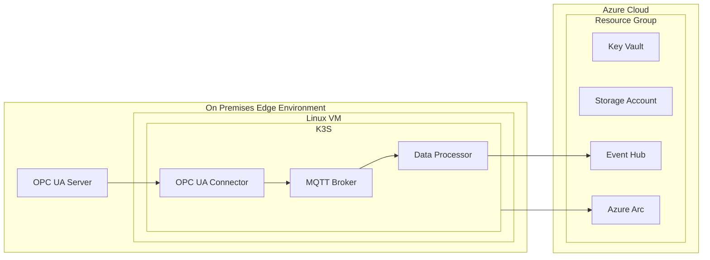

This template defines the standard structure for security plan documents.

## Template Structure

````markdown
# Security Plan - [Blueprint Name]

## Preamble

_Important to note:_ This security analysis cannot certify or attest to the complete security of an architecture or code. This document is intended to help produce security-focused backlog items and document relevant security design decisions.

## Overview

[System description and security approach based on architecture analysis]

## Diagrams

### Architecture Diagrams

Generate Mermaid architecture diagram based on blueprint infrastructure analysis:

* Use graph TD (top-down) or graph LR (left-right) syntax for clarity.
* Include all major components identified from blueprint infrastructure code.
* Show relationships and dependencies between components.
* Use descriptive node names that match the blueprint's resource naming.
* Include security boundaries and trust zones where applicable.

Component categories to include:

* Compute resources (VMs, Kubernetes clusters)
* Storage components (storage accounts, databases)
* Networking elements (load balancers, security groups, subnets)
* Identity and access components (service principals, managed identities)
* IoT and edge services (MQTT brokers, device management, data processors)

Example structure:



### Data Flow Diagrams

Generate Mermaid sequence diagram representing operational data flows:

* Focus on how data moves through the system during normal operations.
* Number each interaction/message sequentially.
* Ensure each numbered edge corresponds to a row in Data Flow Attributes table.
* Include all operational components: APIs, databases, storage, monitoring endpoints, message brokers, data processors.
* Use clear, descriptive participant names matching the architecture diagrams.

### Data Flow Attributes

Table mapping each numbered flow to security characteristics:

| # | Transport Protocol     | Data Classification | Authentication | Authorization  | Notes         |
|---|------------------------|---------------------|----------------|----------------|---------------|
| 1 | [Protocol/TLS version] | [Classification]    | [Auth method]  | [Authz method] | [Description] |

## Secrets Inventory

Comprehensive catalog of all credentials, keys, and sensitive configuration:

| Name | Purpose | Storage Location | Generation Method | Rotation Strategy | Distribution Method | Lifespan | Environment |
| ---- | ------- | ---------------- | ----------------- | ----------------- | ------------------- | -------- | ----------- |

## Threats and Mitigations

Risk Legend:

* 🟢 Mitigated / Low risk
* 🟡 Partially mitigated / Medium risk
* 🔴 Not mitigated / High risk
* ⚪️ Not evaluated

| Threat # | Principle   | Affected Asset | Threat                          | Status   | Risk   |
|----------|-------------|----------------|---------------------------------|----------|--------|
| [#]      | [Principle] | [Asset]        | [Threat description](#threat-X) | [Status] | [Risk] |

## Detailed Threats and Mitigations

For each applicable threat, provide detailed analysis following this format:

### Threat #[X]

**Principle:** [Security Principle]
**Affected Asset:** [Specific system component]
**Threat:** [Detailed threat description]

**Recommended Mitigations:**

1. [Specific, actionable mitigation step]
2. [Implementation details and configuration]
3. [Monitoring and validation approaches]

**Cloud Platform Guidance:** [Provide recommendations specific to the target cloud platform: Azure, AWS, GCP, or multi-cloud considerations]
````

🤖 *Crafted with precision by ✨Copilot following brilliant human instruction, then carefully refined by our team of discerning human reviewers.*
