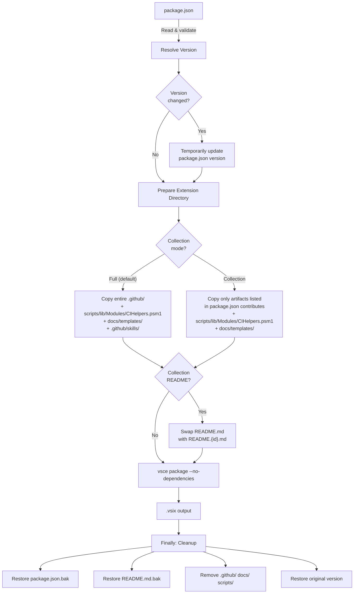

This folder contains the VS Code extension configuration for HVE Core.

## Structure

```plaintext
extension/
├── .github/              # Temporarily copied during packaging (removed after)
├── docs/templates/       # Temporarily copied during packaging (removed after)
├── package.json          # Generated extension manifest (gitignored, created by Prepare-Extension.ps1)\n├── templates/            # Source templates for package generation
├── .vscodeignore         # Controls what gets packaged into the .vsix
├── README.md             # Extension marketplace description
├── LICENSE               # Copy of root LICENSE
├── CHANGELOG.md          # Copy of root CHANGELOG
└── PACKAGING.md          # This file
```

## Extension Configuration

### Extension Kind

The extension is configured with `"extensionKind": ["workspace", "ui"]` in `package.json` to support multiple execution contexts:

* **Workspace mode**: Extension runs in the workspace (remote) extension host. In this mode, the extension accesses its bundled files from the extension installation directory in the remote/workspace context (for example, the packaged `.github/` folder).
* **UI mode**: Extension runs in the UI extension host on the user's local machine and accesses the same bundled extension files from the local installation directory.

Access to files in the user's project workspace always uses the standard VS Code workspace APIs and is independent of the extension kind. Both modes use the same packaged extension assets and differ only in execution context (local UI versus remote/workspace). This bundling approach ensures GitHub Copilot can reliably access instruction files and scripts regardless of cross-platform path resolution issues (for example, Windows/WSL environments).

This is a declarative extension: it contributes configuration and file paths, and VS Code (together with the GitHub Copilot extension) resolves those paths based on the selected extension host and the extension installation location; it does not implement any custom runtime fallback mechanism between workspace and bundled files.

## Prerequisites

Install the VS Code Extension Manager CLI:

```bash
npm install -g @vscode/vsce
```

Install the PowerShell-Yaml module (required for Prepare-Extension.ps1):

```powershell
Install-Module -Name PowerShell-Yaml -Scope CurrentUser
```

## Automated CI/CD Workflows

The extension is automatically packaged and published through GitHub Actions:

| Workflow                                  | Trigger           | Purpose                                     |
|-------------------------------------------|-------------------|---------------------------------------------|
| `.github/workflows/extension-package.yml` | Reusable workflow | Packages extension with flexible versioning |
| `.github/workflows/extension-publish.yml` | Release/manual    | Publishes to VS Code Marketplace            |
| `.github/workflows/main.yml`              | Push to main      | Includes extension packaging in CI          |

## Packaging Pipeline Overview

Extension packaging is a two-step process: **Prepare** discovers and filters artifacts into `package.json`, then **Package** copies files, runs `vsce`, and cleans up.

```mermaid
flowchart LR
    subgraph Prepare["Step 1 · Prepare-Extension.ps1"]
        P1[Load Collection Manifests] --> P2[Discover Artifacts]
        P2 --> P3["Filter by Maturity<br/>+ Collection"]
        P3 --> P4[Resolve Dependencies]
        P4 --> P5[Write package.json]
    end

    subgraph Package["Step 2 · Package-Extension.ps1"]
        K1[Resolve Version] --> K2["Copy Assets<br/>to extension/"]
        K2 --> K3[vsce package]
        K3 --> K4[Cleanup & Restore]
    end

    Prepare --> Package --> VSIX[".vsix"]
```



### Artifact Discovery and Resolution

The prepare step generates collection package files from `collections/*.collection.yml` manifests, discovers all artifact files on disk, filters them by maturity and collection membership, and resolves transitive handoff and requires dependencies to pull in all needed artifacts.

```mermaid
flowchart TB
    CM["Collection Manifests<br/>collections/*.collection.yml"] -->|Get-CollectionManifest| INPUTS
    CH[Channel: Stable / PreRelease] -->|Get-AllowedMaturities| INPUTS

    INPUTS[Resolve Inputs] --> DISC[Discover Artifact Files from .github/]

    DISC --> AG["Agents<br/>.github/agents/**/*.agent.md"]
    DISC --> PR["Prompts<br/>.github/prompts/**/*.prompt.md"]
    DISC --> IN["Instructions<br/>.github/instructions/**/*.instructions.md"]
    DISC --> SK["Skills<br/>.github/skills/**/SKILL.md"]

    AG -->|Filter by maturity| FM[Maturity-Filtered Set]
    PR -->|Filter by maturity| FM
    IN -->|"Filter by maturity<br/>+ exclude root-level"| FM
    SK -->|Filter by maturity| FM

    FM --> CF{"Collection<br/>specified?"}
    CF -->|No| FINAL[Final Artifact Set]
    CF -->|Yes| PA["Filter by collection + globs<br/>Get-CollectionArtifacts"]
    PA --> HD["Resolve Handoff Closure<br/>BFS through agent frontmatter"]
    HD --> RD["Resolve Requires Dependencies<br/>BFS through collection item requires"]
    RD --> INT["Intersect with<br/>discovered artifacts"]
    INT --> FINAL

    FINAL --> UPD["Update package.json contributes<br/>chatAgents · chatPromptFiles<br/>chatInstructions · chatSkills"]
```



## Packaging the Extension

### Using the Automated Scripts (Recommended)

#### Step 1: Prepare the Extension

First, update `package.json` with discovered agents, prompts, and instructions:

```bash
# Discover components and update package.json (Stable channel)
pwsh ./scripts/extension/Prepare-Extension.ps1

# Or use npm script
npm run extension:prepare

# For PreRelease channel (includes preview and experimental artifacts)
pwsh ./scripts/extension/Prepare-Extension.ps1 -Channel PreRelease

# Or use npm script
npm run extension:prepare:prerelease
```

The preparation script automatically:

* Discovers and registers all chat agents from `.github/agents/`
* Discovers and registers all prompts from `.github/prompts/`
* Discovers and registers all instruction files from `.github/instructions/`
* Updates `package.json` with discovered components
* Uses existing version from `package.json` (does not modify it)

#### Step 2: Package the Extension

Then package the extension:

```bash
# Package using version from package.json (Stable channel)
pwsh ./scripts/extension/Package-Extension.ps1

# Or use npm script
npm run extension:package

# Package for PreRelease channel
pwsh ./scripts/extension/Package-Extension.ps1 -PreRelease

# Or use npm script
npm run extension:package:prerelease

# Package with specific version
pwsh ./scripts/extension/Package-Extension.ps1 -Version "1.0.3"

# Package with dev patch number (e.g., 1.0.2-dev.123)
pwsh ./scripts/extension/Package-Extension.ps1 -DevPatchNumber "123"

# Package with version and dev patch number
pwsh ./scripts/extension/Package-Extension.ps1 -Version "1.1.0" -DevPatchNumber "456"
```

The packaging script automatically:

* Uses version from `package.json` (or specified version)
* Optionally appends dev patch number for pre-release builds
* Copies required directories into `extension/` (or only filtered artifacts in collection mode)
* Packages the extension using `vsce`
* Cleans up temporary files and restores all modified files



### Manual Packaging (Legacy)

If you need to package manually:

```bash
cd extension
rm -rf .github scripts && cp -r ../.github . && mkdir -p scripts && vsce package && rm -rf .github scripts
```

## Publishing the Extension

**Important:** Versions are managed by `release-please` via `extension/templates/package.template.json`. The `Prepare-Extension.ps1` script generates all collection package files with the correct version before preparing the extension.

**Setup Personal Access Token (one-time):**

Set your Azure DevOps PAT as an environment variable:

```bash
export VSCE_PAT=your-token-here
```

To get a PAT:

1. Go to <https://dev.azure.com>
2. User settings → Personal access tokens → New Token
3. Set scope to **Marketplace (Manage)**
4. Copy the token

**Publish command:**

```bash
# Publish the packaged extension (replace X.Y.Z with actual version)
vsce publish --packagePath "extension/hve-core-X.Y.Z.vsix"

# Or use the latest .vsix file
VSIX_FILE=$(ls -t extension/hve-core-*.vsix | head -1)
vsce publish --packagePath "$VSIX_FILE"
```

## What Gets Included

The `extension/.vscodeignore` file controls what gets packaged. Currently included:

* `.github/agents/**` - All custom agent definitions
* `.github/prompts/**` - All prompt templates
* `.github/instructions/**` - All instruction files
* `.github/skills/**` - All skill packages
* `docs/templates/**` - Document templates used by agents (ADR, BRD, Security Plan)
* `package.json` - Extension manifest
* `README.md` - Extension description
* `LICENSE` - License file
* `CHANGELOG.md` - Version history

## Testing Locally

Install the packaged extension locally:

```bash
code --install-extension hve-core-*.vsix
```

## Version Management

### How Versions Are Managed

The version source of truth is `extension/templates/package.template.json`. The `release-please` automation updates this file's `version` field on releases. `Prepare-Extension.ps1` generates all `extension/package.json` and `extension/package.*.json` files from the template before performing artifact discovery.

Generated package files are ephemeral build artifacts (gitignored). They are created and consumed by `Prepare-Extension.ps1` and `Package-Extension.ps1` at build time.

### Development Builds

For pre-release or CI builds, use the dev patch number:

```bash
# Creates version like 1.0.2-dev.123
pwsh ./scripts/extension/Package-Extension.ps1 -DevPatchNumber "123"
```

This temporarily modifies the version during packaging but restores it afterward.

### Override Version at Package Time

You can override the version without modifying `package.json`:

```bash
# Package as 1.1.0 without updating package.json
pwsh ./scripts/extension/Package-Extension.ps1 -Version "1.1.0"
```

## Pre-Release Channel

The extension supports dual-channel publishing to VS Code Marketplace with separate stable and pre-release tracks.

### EVEN/ODD Versioning Strategy

| Minor Version     | Channel     | Example      | Agent Maturity Included             |
|-------------------|-------------|--------------|-------------------------------------|
| EVEN (0, 2, 4...) | Stable      | 1.0.0, 1.2.0 | `stable` only                       |
| ODD (1, 3, 5...)  | Pre-Release | 1.1.0, 1.3.0 | `stable`, `preview`, `experimental` |

Users can switch between channels in VS Code via the "Switch to Pre-Release Version" button on the extension page.

### Pre-Release Packaging

Package for the pre-release channel with the `-PreRelease` switch:

```bash
# Prepare with PreRelease channel filtering
pwsh ./scripts/extension/Prepare-Extension.ps1 -Channel PreRelease
# Or use npm script
npm run extension:prepare:prerelease

# Package for pre-release channel (includes experimental agents)
pwsh ./scripts/extension/Package-Extension.ps1 -Version "1.1.0" -PreRelease
# Or use npm script for default version
npm run extension:package:prerelease
```

The `-PreRelease` switch adds `--pre-release` to the vsce command, marking the package for the Marketplace pre-release track.

### Pre-Release Workflow

Use the manual workflow for publishing pre-releases:

1. Go to **Actions** > **Publish Pre-Release Extension**
2. Enter an ODD minor version (e.g., `1.1.0`, `1.3.0`)
3. Optionally enable dry-run to test packaging without publishing
4. Run the workflow

The workflow validates the version is ODD before proceeding.

### Agent Maturity Filtering

When packaging, artifacts are filtered by their `maturity` field in `collections/*.collection.yml` item entries:

| Channel    | Included Maturity Levels            |
|------------|-------------------------------------|
| Stable     | `stable`                            |
| PreRelease | `stable`, `preview`, `experimental` |

See [Agent Maturity Levels](../docs/contributing/ai-artifacts-common.md#maturity-field-requirements) for contributor guidance on setting maturity levels.

## Collection-Based Packaging

The extension supports building collection-specific packages from a single codebase.

### Available Collections

Collection manifests are defined in root `collections/` as YAML files:

| Collection | Manifest                      | Description                            |
|------------|-------------------------------|----------------------------------------|
| Full       | `hve-core-all.collection.yml` | All artifacts regardless of collection |
| Developer  | `developer.collection.yml`    | Software engineering focused artifacts |

### Collection Package Files

All collection package files (`extension/package.json`, `extension/package.*.json`) are generated by `Prepare-Extension.ps1` from the source template and root collection YAML metadata. These files are gitignored build artifacts.

| Generated File      | Source Collection             | Purpose                     |
|---------------------|-------------------------------|-----------------------------|
| `package.json`      | `hve-core-all.collection.yml` | Full bundle manifest        |
| `package.{id}.json` | `{id}.collection.yml`         | Collection edition metadata |

When building a non-default collection, `Prepare-Extension.ps1`:

1. Backs up `package.json` to `package.json.bak`
2. Copies the collection template (`package.{id}.json`) over `package.json`
3. Generates `contributes` into the copied file
4. Serializes the result as `package.json`

After packaging, `Package-Extension.ps1` restores the canonical `package.json` from backup in its `finally` block.

#### Version Synchronization

`release-please` manages the version in `extension/templates/package.template.json`. The `Prepare-Extension.ps1` script generates all collection package files with the propagated version. No manual version updates are needed.

### Building Collection Packages

To build a specific collection package:

```bash
# Build the full collection (default, no template copy)
pwsh ./scripts/extension/Prepare-Extension.ps1
pwsh ./scripts/extension/Package-Extension.ps1

# Build a collection-specific package (copies collection template)
pwsh ./scripts/extension/Prepare-Extension.ps1 -Collection collections/developer.collection.yml
pwsh ./scripts/extension/Package-Extension.ps1 -Collection collections/developer.collection.yml
```

When `-Collection` targets a collection other than `hve-core-all`, the prepare script copies the collection template to `package.json` before generating `contributes`. The packaging script restores the canonical `package.json` after building.

### Inner Dev Loop

For rapid iteration without running the full build pipeline:

```bash
# 1. Prepare the extension (generates package files and discovers artifacts)
pwsh ./scripts/extension/Prepare-Extension.ps1 -Collection collections/developer.collection.yml

# 2. Inspect the result
cat extension/package.json | python3 -c "import sys,json; d=json.load(sys.stdin); print(d['name'], len(d.get('contributes',{}).get('chatAgents',[])),'agents')"

# 3. Regenerate clean package files with a fresh prepare
pwsh ./scripts/extension/Prepare-Extension.ps1
```

Generated package files are gitignored. Each `Prepare-Extension.ps1` invocation regenerates them from the template.

### Collection Resolution

When building a collection, the system applies a multi-stage filter pipeline: collection matching, maturity gating, optional glob patterns, and two rounds of dependency resolution.

```mermaid
flowchart TB
    CI["Collection Item<br/>path · kind · maturity · requires"] --> PF{"Collection match?<br/>empty items = universal"}
    CM["Collection Manifest<br/>items array"] --> PF
    CH["Channel<br/>Stable / PreRelease"] --> MF

    PF -->|Yes| MF{"Maturity<br/>allowed?"}
    PF -->|No| EXCLUDE[Excluded]

    MF -->|Yes| GLOB{"Passes include/exclude<br/>glob filter?"}
    MF -->|No| EXCLUDE

    GLOB -->|Yes| SEED[Seed Artifact]
    GLOB -->|No| EXCLUDE

    SEED --> HANDOFF["Resolve Handoff Closure<br/>BFS through agent frontmatter<br/>handoff targets bypass maturity filter"]
    HANDOFF --> REQUIRES["Resolve Requires Dependencies<br/>BFS through collection item requires blocks<br/>across agents · prompts · instructions · skills"]
    REQUIRES --> FINAL[Final Collection Artifact Set]
```



Key behaviors:

* Artifacts with an empty `items` array are universal and included in every collection
* Handoff targets bypass maturity filtering by design (an agent must be able to hand off to its declared targets)
* The `requires` block in collection items supports transitive resolution: if agent A requires agent B, and B requires instruction C, all three are included
* Optional `include` and `exclude` glob arrays in the collection manifest provide fine-grained control per artifact type

### Testing Collection Builds Locally

To verify artifact inclusion before publishing:

```bash
# 1. Prepare with collection filtering
pwsh ./scripts/extension/Prepare-Extension.ps1 -Collection collections/developer.collection.yml -Verbose

# 2. Check package.json for included artifacts
cat extension/package.json | jq '.contributes.chatAgents'

# 3. Validate collection metadata
npm run lint:collections-metadata

# 4. Build the package (dry run)
pwsh ./scripts/extension/Package-Extension.ps1 -Version "1.0.0-test" -WhatIf
```

### Troubleshooting Collection Builds

**Missing artifacts in collection:**

1. Verify the artifact has an `items[]` entry in the relevant `collections/*.collection.yml` manifest
2. Check the collection manifest includes the artifact with the correct `kind` and `path`
3. Run `npm run lint:collections-metadata` to validate collection consistency

**Dependency not included:**

1. Check the parent artifact's `requires` field in the collection item
2. Ensure dependent artifacts exist and have valid collection entries
3. Dependencies are included regardless of collection filter

**Validation errors:**

```bash
# Run full collection metadata validation
npm run lint:collections-metadata

# Validate YAML syntax of collection manifests
npm run lint:yaml
```

### Collection Manifest Schema

Collection manifests are YAML files in `collections/` following this structure:

```yaml
id: developer
name: hve-developer
displayName: "HVE Core - Developer Edition"
description: "AI-powered coding agents curated for software engineers"
maturity: stable
items:
  - kind: agent
    # path can reference artifacts from any subfolder
    path: .github/agents/{collection-id}/my-agent.agent.md
    maturity: stable
```

| Field         | Required | Description                                                                                           |
|---------------|----------|-------------------------------------------------------------------------------------------------------|
| `id`          | Yes      | Unique identifier for the collection                                                                  |
| `name`        | Yes      | Extension package name                                                                                |
| `displayName` | Yes      | Marketplace display name                                                                              |
| `description` | Yes      | Marketplace description text                                                                          |
| `maturity`    | No       | Release channel eligibility (`stable`, `preview`, `experimental`, `deprecated`). Defaults to `stable` |
| `items`       | Yes      | Array of collection identifiers to include                                                            |

#### Collection Maturity and Channel Eligibility

The `maturity` field controls which release channels include the collection:

| Collection Maturity | PreRelease Channel | Stable Channel |
|---------------------|--------------------|----------------|
| `stable`            | Yes                | Yes            |
| `preview`           | Yes                | Yes            |
| `experimental`      | Yes                | No             |
| `deprecated`        | No                 | No             |

Collection-level maturity is independent of artifact-level maturity. A `stable` collection can contain `preview` artifacts, which are filtered by the existing artifact-level channel logic. The collection maturity gates the entire package, while artifact maturity gates individual files within it.

Omitting the `maturity` field defaults to `stable`, maintaining backward compatibility with existing manifests.

### Adding New Collections

To create a new collection:

1. Create a new collection manifest in `collections/`:

    ```yaml
    id: my-collection
    name: hve-my-collection
    displayName: "HVE Core - My Collection Edition"
    description: "Description of artifacts included for this collection"
    maturity: experimental
    items:
      - kind: agent
        # path can reference artifacts from any subfolder
        path: .github/agents/{collection-id}/my-agent.agent.md
        maturity: experimental
    ```

2. Add artifact entries to the `items` array in the manifest
3. Set `kind`, `path`, and optionally `maturity` for each item
4. Test the build locally with `-Collection collections/my-collection.collection.yml`
5. Submit PR with the new collection manifest

> [!TIP]
> New collections should start with `"maturity": "experimental"` until validated. Change to `"stable"` when the collection is ready for production.

## Notes

* The `.github` and `docs/templates` folders are temporarily copied during packaging (not permanently stored)
* `LICENSE` and `CHANGELOG.md` are copied from root during packaging and excluded from git
* Only essential extension files are included (agents, prompts, instructions, skills, templates)
* Repo-specific instructions at the root of `.github/instructions/` are excluded from all builds
* Non-essential files are excluded (workflows, issue templates, agent installer, etc.)
* The root `package.json` contains development scripts for the repository

---

<!-- markdownlint-disable MD036 -->
*🤖 Crafted with precision by ✨Copilot following brilliant human instruction,
then carefully refined by our team of discerning human reviewers.*
<!-- markdownlint-enable MD036 -->
